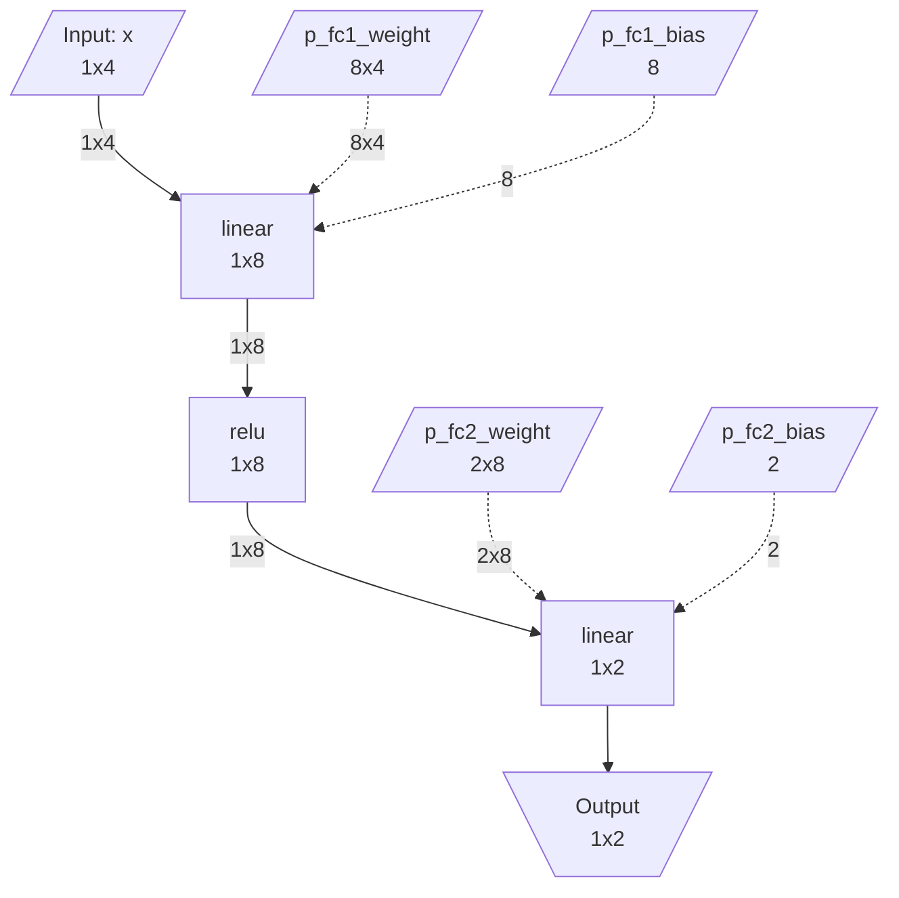

[English](README.md)

# IR Extraction Framework

[](https://pypi.org/project/pytorch-ir/)
[](https://pypi.org/project/pytorch-ir/)
[](LICENSE)
[](https://sweetcocoa.github.io/pytorch-ir/)
[](https://github.com/sweetcocoa/pytorch-ir/actions/workflows/publish.yml)

PyTorch 모델에서 컴파일러 백엔드용 IR(Intermediate Representation)을 추출하는 프레임워크입니다.

## 빠른 시작

### 설치

```bash
# uv 사용 (권장)
uv sync

# 또는 pip 사용
pip install -e .
```

### 기본 사용법

```python
import torch
import torch.nn as nn
from torch_ir import extract_ir, ir_to_mermaid

class SimpleMLP(nn.Module):
    def __init__(self):
        super().__init__()
        self.fc1 = nn.Linear(4, 8)
        self.relu = nn.ReLU()
        self.fc2 = nn.Linear(8, 2)

    def forward(self, x):
        return self.fc2(self.relu(self.fc1(x)))

# 1. Meta device에서 모델 생성 (실제 weight 로드 없음)
with torch.device('meta'):
    model = SimpleMLP()
model.eval()

# 2. IR 추출
example_inputs = (torch.randn(1, 4, device='meta'),)
ir = extract_ir(model, example_inputs)

# 3. IR 저장
ir.save("model_ir.json")

# 4. IR 시각화
print(ir_to_mermaid(ir))
```

### 추출된 IR

위 모델에서 추출된 IR은 다음과 같은 JSON으로 직렬화됩니다. 각 노드에는 ATen 연산 타입, 입출력 텐서 메타데이터, producer-consumer 관계가 기록되며 weight 값은 포함되지 않습니다.

```json
{
  "model_name": "SimpleMLP",
  "graph_inputs":  [{"name": "x", "shape": [1, 4], "dtype": "float32"}],
  "graph_outputs": [{"name": "linear_1", "shape": [1, 2], "dtype": "float32"}],
  "weights": [
    {"name": "fc1.weight", "shape": [8, 4], "dtype": "float32"},
    {"name": "fc1.bias",   "shape": [8],    "dtype": "float32"},
    {"name": "fc2.weight", "shape": [2, 8], "dtype": "float32"},
    {"name": "fc2.bias",   "shape": [2],    "dtype": "float32"}
  ],
  "nodes": [
    {
      "name": "linear", "op_type": "aten.linear.default",
      "inputs":  [{"name": "x", "shape": [1, 4]}, {"name": "p_fc1_weight", "shape": [8, 4]}, {"name": "p_fc1_bias", "shape": [8]}],
      "outputs": [{"name": "linear", "shape": [1, 8]}]
    },
    {
      "name": "relu", "op_type": "aten.relu.default",
      "inputs":  [{"name": "linear", "shape": [1, 8]}],
      "outputs": [{"name": "relu", "shape": [1, 8]}]
    },
    {
      "name": "linear_1", "op_type": "aten.linear.default",
      "inputs":  [{"name": "relu", "shape": [1, 8]}, {"name": "p_fc2_weight", "shape": [2, 8]}, {"name": "p_fc2_bias", "shape": [2]}],
      "outputs": [{"name": "linear_1", "shape": [1, 2]}]
    }
  ]
}
```

### IR 시각화

`ir_to_mermaid()`는 IR을 Mermaid 플로우차트로 렌더링합니다. Weight 입력은 점선 엣지로 표시됩니다:



### IR 검증

```python
# 원본 모델과 IR 실행 결과 비교
original_model = SimpleMLP()
original_model.load_state_dict(torch.load('weights.pt'))
original_model.eval()

test_input = torch.randn(1, 4)
is_valid, report = verify_ir_with_state_dict(
    ir=ir,
    state_dict=original_model.state_dict(),
    original_model=original_model,
    test_inputs=(test_input,),
)

print(f"Verification: {'PASSED' if is_valid else 'FAILED'}")
```

## 문서

- [개념 및 아키텍처](docs/concepts.md) - 프레임워크의 핵심 개념과 설계
- [환경 설정](docs/setup.md) - 설치 및 개발 환경 구성
- [사용 가이드](docs/usage.md) - 상세 사용법과 예제
- [API 레퍼런스](docs/api/index.md) - 공개 API 문서
- [연산자 지원](docs/operators.md) - 지원되는 ATen 연산자 목록
- [확장 가이드](docs/extending.md) - 커스텀 연산자 추가 방법

## 의존성

- Python >= 3.10
- PyTorch >= 2.1

## 테스트 실행

```bash
# 기본 테스트
uv run pytest tests/ -v

# 종합 테스트 (모든 테스트 모델)
uv run pytest tests/test_comprehensive.py -v

# 리포트 생성
uv run pytest tests/test_comprehensive.py --generate-reports --output reports/

# 카테고리별 필터
uv run pytest tests/test_comprehensive.py -k "attention" -v

# CLI로 실행
uv run python -m tests --output reports/
uv run python -m tests --list-models
uv run python -m tests --category attention
```

## 주요 특징

- **Weight-free 추출**: Meta tensor를 활용하여 실제 weight를 메모리에 로드하지 않고 그래프 구조만 추출
- **torch.export 기반**: PyTorch 공식 권장 방식인 TorchDynamo 기반 tracing 사용
- **완전한 메타데이터**: 모든 텐서의 shape, dtype 정보 자동 추출
- **IR 실행 및 검증**: 추출된 IR을 실행하여 원본 모델과 동일한 결과 검증 가능
- **확장 가능한 설계**: 커스텀 연산자 등록 메커니즘 제공

## 라이선스

MIT License
