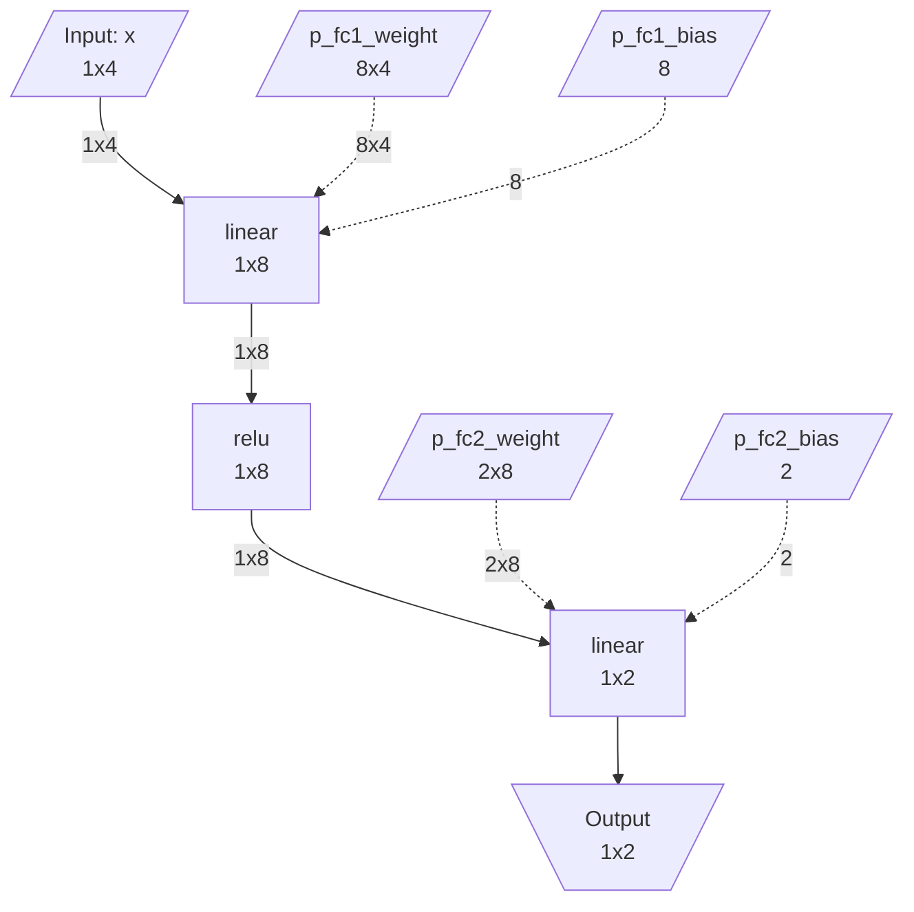

[한국어](README.ko.md)

# IR Extraction Framework

A framework for extracting compiler-backend IR (Intermediate Representation) from PyTorch models.

## Quick Start

### Installation

```bash
# Using uv (recommended)
uv sync

# Or using pip
pip install -e .
```

### Basic Usage

```python
import torch
import torch.nn as nn
from torch_ir import extract_ir, ir_to_mermaid

class SimpleMLP(nn.Module):
    def __init__(self):
        super().__init__()
        self.fc1 = nn.Linear(4, 8)
        self.relu = nn.ReLU()
        self.fc2 = nn.Linear(8, 2)

    def forward(self, x):
        return self.fc2(self.relu(self.fc1(x)))

# 1. Create model on meta device (no actual weights loaded)
with torch.device('meta'):
    model = SimpleMLP()
model.eval()

# 2. Extract IR
example_inputs = (torch.randn(1, 4, device='meta'),)
ir = extract_ir(model, example_inputs)

# 3. Save IR
ir.save("model_ir.json")

# 4. Visualize IR
print(ir_to_mermaid(ir))
```

### Extracted IR

The IR above produces the following JSON. Each node records its ATen op type, input/output tensor metadata, and producer-consumer relationships — weight values are not included.

```json
{
  "model_name": "SimpleMLP",
  "graph_inputs":  [{"name": "x", "shape": [1, 4], "dtype": "float32"}],
  "graph_outputs": [{"name": "linear_1", "shape": [1, 2], "dtype": "float32"}],
  "weights": [
    {"name": "fc1.weight", "shape": [8, 4], "dtype": "float32"},
    {"name": "fc1.bias",   "shape": [8],    "dtype": "float32"},
    {"name": "fc2.weight", "shape": [2, 8], "dtype": "float32"},
    {"name": "fc2.bias",   "shape": [2],    "dtype": "float32"}
  ],
  "nodes": [
    {
      "name": "linear", "op_type": "aten.linear.default",
      "inputs":  [{"name": "x", "shape": [1, 4]}, {"name": "p_fc1_weight", "shape": [8, 4]}, {"name": "p_fc1_bias", "shape": [8]}],
      "outputs": [{"name": "linear", "shape": [1, 8]}]
    },
    {
      "name": "relu", "op_type": "aten.relu.default",
      "inputs":  [{"name": "linear", "shape": [1, 8]}],
      "outputs": [{"name": "relu", "shape": [1, 8]}]
    },
    {
      "name": "linear_1", "op_type": "aten.linear.default",
      "inputs":  [{"name": "relu", "shape": [1, 8]}, {"name": "p_fc2_weight", "shape": [2, 8]}, {"name": "p_fc2_bias", "shape": [2]}],
      "outputs": [{"name": "linear_1", "shape": [1, 2]}]
    }
  ]
}
```

### IR Visualization

`ir_to_mermaid()` renders the IR as a Mermaid flowchart. Weight inputs are shown as dashed edges:



### Verification

```python
# Compare original model output with IR execution result
original_model = SimpleMLP()
original_model.load_state_dict(torch.load('weights.pt'))
original_model.eval()

test_input = torch.randn(1, 4)
is_valid, report = verify_ir_with_state_dict(
    ir=ir,
    state_dict=original_model.state_dict(),
    original_model=original_model,
    test_inputs=(test_input,),
)

print(f"Verification: {'PASSED' if is_valid else 'FAILED'}")
```

## Documentation

- [Concepts & Architecture](docs/concepts.md) - Core concepts and design of the framework
- [Setup](docs/setup.md) - Installation and development environment configuration
- [Usage Guide](docs/usage.md) - Detailed usage and examples
- [API Reference](docs/api/index.md) - Public API documentation
- [Operator Support](docs/operators.md) - Supported ATen operators
- [Extension Guide](docs/extending.md) - How to add custom operators

## Dependencies

- Python >= 3.10
- PyTorch >= 2.1

## Running Tests

```bash
# Basic tests
uv run pytest tests/ -v

# Comprehensive tests (all test models)
uv run pytest tests/test_comprehensive.py -v

# Generate reports
uv run pytest tests/test_comprehensive.py --generate-reports --output reports/

# Filter by category
uv run pytest tests/test_comprehensive.py -k "attention" -v

# Run via CLI
uv run python -m tests --output reports/
uv run python -m tests --list-models
uv run python -m tests --category attention
```

## Features

- **Weight-free extraction**: Uses meta tensors to extract only graph structure without loading actual weights into memory
- **torch.export based**: Uses TorchDynamo-based tracing, the officially recommended PyTorch approach
- **Complete metadata**: Automatically extracts shape and dtype information for all tensors
- **IR execution & verification**: Execute the extracted IR and verify results match the original model
- **Extensible design**: Provides a custom operator registration mechanism

## License

MIT License
