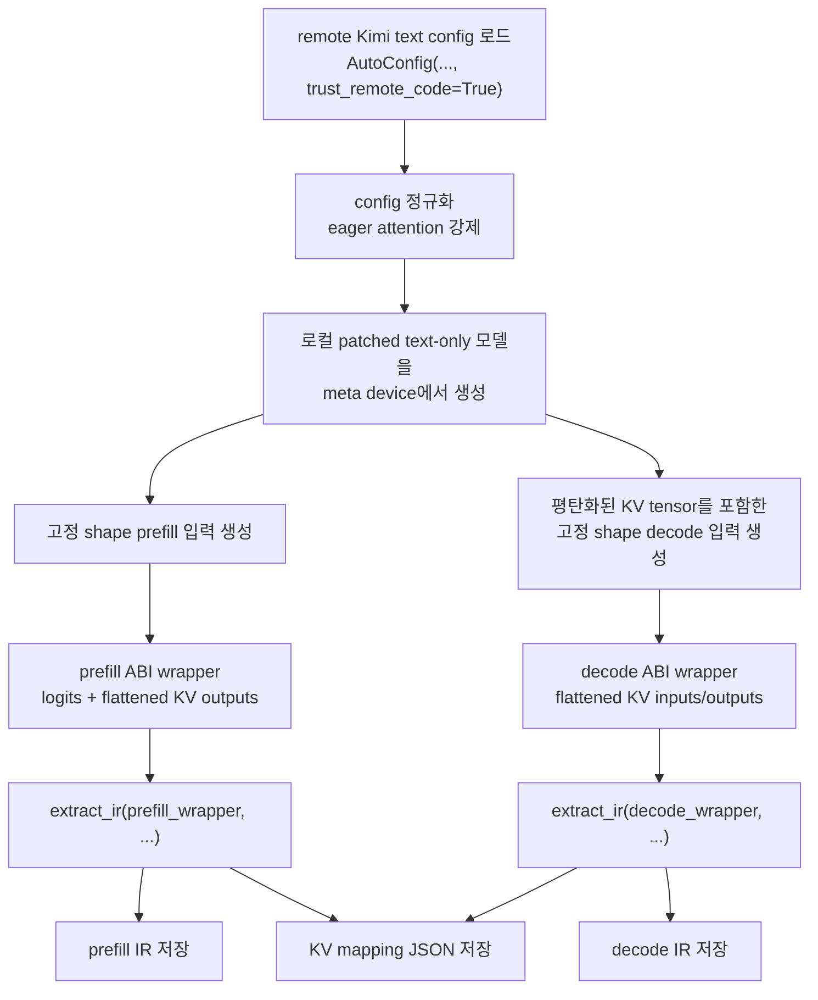

# 고급 예제

이 가이드는 `pytorch-ir`로 초대형 autoregressive MoE 모델의 static IR를 추출하는 방법을 설명합니다. 구체적인 예제로는 text-only Kimi-K2.5 추출 흐름을 사용합니다.

## 왜 초대형 모델 예제가 필요한가

대형 언어 모델에서는 보통 문제의 핵심이 "weight를 올릴 수 있는가?"가 아니라 "그래프를 export 가능한 형태로 만들 수 있는가?"인 경우가 많습니다.

`pytorch-ir`에서는 모델과 예제 입력을 `meta` device에 두기 때문에 IR 추출 과정에서 실제 파라미터 값이 필요하지 않습니다. 그래서 원본 체크포인트가 로컬 메모리나 저장공간에 들어가지 않는 경우에도 추출 단계 자체는 진행할 수 있습니다.

하지만 그렇다고 추출이 가벼운 것은 아닙니다. 초대형 모델에서 여전히 비싼 부분은 다음입니다.

- `torch.export` 추적과 정규화
- 그래프 분석과 IR 변환
- 큰 고정 shape cache 인터페이스 처리

실제로 초대형 모델 IR 추출의 핵심은 weight를 읽지 않는 것보다, forward 경로를 export-friendly 하게 만들고 `extract_ir()`에 안정적인 compiler/runtime용 callable ABI를 넘기는 데 있습니다.

## 왜 Kimi-K2.5를 선택했는가

Kimi-K2.5는 inference 인프라 관점에서 좋은 초대형 사례입니다. export를 어렵게 만드는 요소가 한 모델 안에 같이 들어 있기 때문입니다.

- **총 1T 파라미터**, **32B 활성 파라미터**
- **256K 컨텍스트 길이**
- **61개 레이어**
- **384개 routed experts**, token당 **8개 expert 선택**
- text generation만 필요해도 top-level은 multimodal 구조

그래서 다음 주제를 한 번에 보여주기에 적합합니다.

- 큰 static cache 인터페이스
- prefill/decode 그래프 분리
- MoE export 제약
- remote config와 local patched model의 조합

이 문서에서 **text-only** IR만 다루는 이유는 그냥 편의상입니다. 목적은 multimodal 전체를 설명하는 것이 아니라, huge-model 추출 패턴을 설명하는 데 있습니다.

## 사례: Kimi-K2.5 Text-Only IR 추출

이 예제는 세 가지 아이디어를 함께 사용합니다.

- `AutoConfig(..., trust_remote_code=True)`로 원격 Hugging Face config 로드
- export를 위해 **로컬 패치된 text-only 모델** 사용
- 추출을 **prefill** 과 **decode** 그래프로 분리

왜 upstream 저장소의 모델 코드를 그대로 export하지 않고 로컬 패치를 쓰는가?

- Kimi-K2.5는 MoE 모델입니다.
- 원본 저장소 코드는 `meta + torch.export` 추출을 전제로 작성되어 있지 않습니다.
- text backbone 쪽에 export-friendly 한 MoE 및 cache 처리가 필요합니다.
- multimodal stack은 text-only IR 추출에는 필요하지 않습니다.

그래서 실제 추출 대상은 다음 조합이 됩니다.

- Hugging Face의 remote config
- export-friendly 하게 패치된 로컬 text-only modeling code

## 추출 흐름



## 추출 스크립트 구조

이 스크립트는 downstream runtime이 실제로 필요로 하는 ABI를 기준으로 구성됩니다.

### 1. remote text config 로드

```python
from copy import deepcopy
from transformers import AutoConfig

MODEL_ID = "moonshotai/Kimi-K2.5"


def prepare_text_config(config):
    config._attn_implementation = "eager"
    if getattr(config, "rope_scaling", None) is None and hasattr(config, "to_dict"):
        rope_scaling = config.to_dict().get("rope_scaling")
        if rope_scaling is not None:
            config.rope_scaling = rope_scaling
    return config


def load_default_config():
    remote_config = AutoConfig.from_pretrained(MODEL_ID, trust_remote_code=True)
    return prepare_text_config(remote_config.text_config)
```

중요한 점은 다음과 같습니다.

- 예제는 remote config 객체를 그대로 사용합니다.
- export된 그래프를 예측 가능하게 유지하기 위해 eager attention을 강제합니다.
- 모델 생성 전에 config 정규화를 먼저 수행합니다.

### 2. 모델을 `meta` 에서 생성

```python
import torch
from kimi_k25_text_local import KimiK25TextForCausalLM

def build_model(config, *, device: str) -> KimiK25TextForCausalLM:
    with torch.device(device):
        model = KimiK25TextForCausalLM(config)
    return model.to(dtype=config.dtype)
```

이렇게 하면 실제 weight를 만들지 않으면서도 shape 및 dtype 메타데이터는 유지할 수 있습니다.

### 3. 고정 shape prefill 입력 만들기

```python
def build_prefill_meta_inputs(config, prefill_seq_len: int):
    positions = torch.arange(prefill_seq_len, device="meta").unsqueeze(0)
    attention_mask = make_additive_causal_mask(
        query_positions=positions[0],
        key_length=prefill_seq_len,
        device=torch.device("meta"),
    )
    return (
        torch.randint(0, config.vocab_size, (1, prefill_seq_len), device="meta"),
        attention_mask,
        positions,
    )
```

Prefill은 고정된 `(batch=1, seq_len=prefill_seq_len)` 인터페이스로 export됩니다.

### 4. 고정 shape decode 입력 만들기

```python
def build_decode_meta_inputs(config, prefill_seq_len: int, max_cache_len: int):
    positions = torch.tensor([[prefill_seq_len]], device="meta")
    attention_mask = make_additive_causal_mask(
        query_positions=positions[0],
        key_length=max_cache_len,
        device=torch.device("meta"),
    )

    past_kv_args = []
    head_dim = config.qk_nope_head_dim + config.qk_rope_head_dim
    for _ in range(config.num_hidden_layers):
        past_kv_args.append(
            torch.randn(
                1,
                config.num_attention_heads,
                max_cache_len,
                head_dim,
                device="meta",
                dtype=config.dtype,
            )
        )
        past_kv_args.append(
            torch.randn(
                1,
                config.num_attention_heads,
                max_cache_len,
                config.v_head_dim,
                device="meta",
                dtype=config.dtype,
            )
        )

    return (
        torch.randint(0, config.vocab_size, (1, 1), device="meta"),
        attention_mask,
        positions,
        torch.tensor([prefill_seq_len], device="meta"),
        *past_kv_args,
    )
```

Decode는 고정된 `(batch=1, seq_len=1, kv_len=max_cache_len)` 인터페이스로 export됩니다.

## 왜 wrapper가 필요한가

`extract_ir()`는 전달받은 callable의 시그니처를 그대로 trace합니다. 초대형 autoregressive 모델에서는 원본 모델 callable이 곧바로 compiler나 runtime에 넘기기 좋은 ABI인 경우가 드뭅니다.

Wrapper 계층은 이 불일치를 해결합니다.

### Prefill wrapper

```python
class KimiPrefillWrapper(nn.Module):
    def __init__(self, model):
        super().__init__()
        self.model = model

    def forward(self, input_ids, attention_mask, position_ids):
        outputs = self.model(
            input_ids=input_ids,
            attention_mask=attention_mask,
            position_ids=position_ids,
            use_cache=True,
        )
        result = [outputs.logits]
        for layer_kv in outputs.past_key_values:
            result.append(layer_kv[0])
            result.append(layer_kv[1])
        return tuple(result)
```

이 wrapper가 필요한 이유는 다음과 같습니다.

- 원본 모델은 구조화된 `past_key_values`를 반환합니다.
- compiler backend는 보통 명시적인 graph output을 원합니다.
- KV 출력을 평탄화하면 모든 레이어에 대해 안정적인 출력 순서를 만들 수 있습니다.

### Decode wrapper

```python
class KimiDecodeWrapper(nn.Module):
    def __init__(self, model, num_layers: int, seen_tokens: int, max_cache_len: int):
        super().__init__()
        self.model = model
        self.num_layers = num_layers
        self.seen_tokens = seen_tokens
        self.max_cache_len = max_cache_len

    def forward(self, input_ids, attention_mask, position_ids, cache_position, *past_kv_flat):
        cache = _IndexCopyCache(past_kv_flat, self.num_layers, self.seen_tokens, self.max_cache_len)
        outputs = self.model(
            input_ids=input_ids,
            attention_mask=attention_mask,
            position_ids=position_ids,
            past_key_values=cache,
            cache_position=cache_position,
            use_cache=True,
        )
        result = [outputs.logits]
        for idx in range(self.num_layers):
            result.append(cache.key_cache[idx])
            result.append(cache.value_cache[idx])
        return tuple(result)
```

이 wrapper가 필요한 이유는 다음과 같습니다.

- decode는 cache tensor를 명시적 graph input으로 받아야 합니다.
- decode는 갱신된 cache tensor를 명시적 graph output으로 돌려줘야 합니다.
- cache를 평탄화하면 export된 시그니처가 결정적이고 backend 친화적으로 유지됩니다.

Wrapper가 없으면 export된 그래프 인터페이스가 모델 내부 Python 객체 표현에 너무 강하게 결합됩니다.

## 왜 decode에는 static cache wrapper가 필요한가

Decode export에는 일반 wrapper만으로는 부족합니다. cache 갱신이 export된 그래프 안에서 tensor op으로 보이도록 해 주는 cache 객체가 필요합니다.

```python
class _IndexCopyCache:
    def __init__(self, kv_flat, num_layers: int, seen_tokens: int, max_cache_len: int):
        self.key_cache = [kv_flat[2 * i] for i in range(num_layers)]
        self.value_cache = [kv_flat[2 * i + 1] for i in range(num_layers)]
        self._seen_tokens = seen_tokens
        self._max_cache_len = max_cache_len

    def update(self, key_states, value_states, layer_idx, cache_kwargs=None):
        cache_position = cache_kwargs["cache_position"]
        self.key_cache[layer_idx] = self.key_cache[layer_idx].index_copy(2, cache_position, key_states)
        self.value_cache[layer_idx] = self.value_cache[layer_idx].index_copy(2, cache_position, value_states)
        return self.key_cache[layer_idx], self.value_cache[layer_idx]
```

이 객체가 필요한 이유는 다음과 같습니다.

- cache buffer shape가 고정되어 있어야 합니다.
- cache 갱신이 명시적 tensor 연산으로 나타나야 합니다.
- export된 그래프 인터페이스 밖의 숨겨진 Python-side mutation이 없어야 합니다.

`index_copy`를 사용하면 cache 갱신이 일반 tensor op처럼 그래프에 나타나므로, IR와 downstream executor가 그대로 다룰 수 있습니다.

## 최종 추출 호출

전체 추출 흐름은 두 개의 그래프와 하나의 mapping 파일을 생성합니다.

```python
with torch.device("meta"):
    model = build_model(config, device="meta")
model.eval()

prefill_wrapper = KimiPrefillWrapper(model)
prefill_inputs = build_prefill_meta_inputs(config, prefill_seq_len)
prefill_ir = extract_ir(prefill_wrapper, prefill_inputs, model_name="KimiK25_Text_Prefill")

decode_wrapper = KimiDecodeWrapper(model, config.num_hidden_layers, prefill_seq_len, max_cache_len)
decode_inputs = build_decode_meta_inputs(config, prefill_seq_len, max_cache_len)
decode_ir = extract_ir(decode_wrapper, decode_inputs, model_name="KimiK25_Text_Decode")
```

추출 후 예제는 다음을 저장합니다.

- prefill IR
- decode IR
- 레이어별 KV mapping 메타데이터

## 출력 산출물

예제는 세 개의 파일을 생성합니다.

- `kimi_k25_text_prefill_ir.json`
- `kimi_k25_text_decode_ir.json`
- `kimi_k25_text_kv_mapping.json`

각 파일의 역할은 다릅니다.

- `prefill` IR은 전체 prompt pass를 설명하고, logits와 초기 KV tensor를 출력합니다.
- `decode` IR은 고정된 cache 입력과 출력을 갖는 one-token decode를 설명합니다.
- `kv_mapping`은 prefill KV 출력이 decode KV 입력 및 출력과 어떻게 대응되는지 runtime에 알려줍니다.

대형 모델에서는 하나의 export 그래프에 두 단계를 억지로 합치는 것보다, 이런 식으로 분리하는 편이 통합이 훨씬 쉬운 경우가 많습니다.

## 이 예제가 하지 않는 것

- 실제 모델 weight를 다운로드하거나 로드하지 않습니다.
- 원본 Kimi multimodal stack을 export하지 않습니다.
- tiny verification mode는 이 문서에서 다루지 않습니다.

이 페이지는 의도적으로 실제 huge-model 추출 경로에만 집중합니다.

## 요약

초대형 autoregressive 모델에서 IR 추출이 성공하려면 보통 세 가지가 필요합니다.

- 원본 아키텍처를 보존하는 remote config
- export-friendly 하게 패치된 로컬 modeling code
- 명시적인 static cache tensor를 갖는 wrapper 기반 prefill/decode 인터페이스

이 조합을 사용하면 원본 모델을 일반적인 weight-loaded 형태로 실행할 수 없는 환경에서도 `pytorch-ir`로 안정적이고 backend 지향적인 IR를 추출할 수 있습니다.
