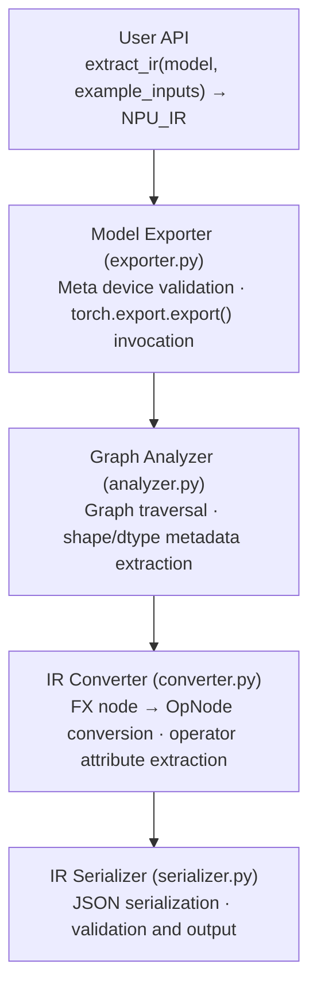
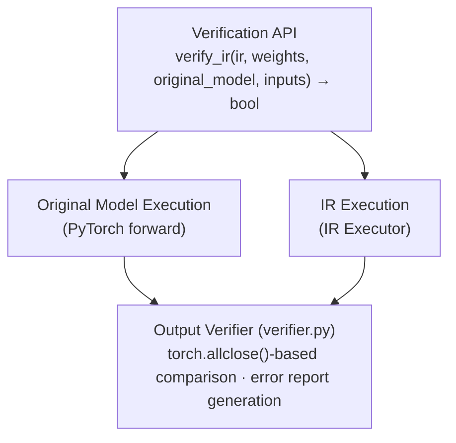

# Concepts and Architecture

This document explains the core concepts and design philosophy of the NPU IR framework.

## 1. Overview

### 1.1 Purpose

The NPU IR framework extracts intermediate representation (IR) from PyTorch models that can be consumed by NPU compilers. The key objectives are:

- **Weight-free extraction**: Extract only graph structure and shape/dtype metadata without actual weight values
- **Standardized representation**: Consistent IR decomposed into low-level ATen operations
- **Verifiability**: Validate IR correctness by comparing against the original model

### 1.2 Why Weight-free?

For large-scale models (LLMs, etc.), weights can reach tens to hundreds of GB. Since the IR extraction stage only needs graph structure and tensor metadata, not loading weights provides:

- Significant reduction in memory usage
- Faster IR extraction
- Increased flexibility in compilation pipeline

## 2. Core Concepts

### 2.1 Meta Tensor

PyTorch's meta device creates "fake" tensors that only have shape and dtype information without actual data.

```python
# Create meta tensor
t = torch.randn(1, 3, 224, 224, device='meta')
print(t.shape)   # torch.Size([1, 3, 224, 224])
print(t.dtype)   # torch.float32
print(t.device)  # device(type='meta')
# t has no actual data (uses 0 memory)

# Create model on meta device
with torch.device('meta'):
    model = torch.nn.Linear(1000, 1000)  # 4MB weight not actually allocated
```

### 2.2 torch.export

`torch.export` is the official model export API introduced in PyTorch 2.0+.

**Features:**
- TorchDynamo-based Python bytecode level tracing
- Uses FakeTensor internally (subclass of meta tensor)
- Generates low-level graph at ATen level
- Static shape analysis and automatic metadata recording

**Alternative comparison:**

| Method | Status | Notes |
|--------|--------|-------|
| torch.export | ✅ Recommended | TorchDynamo-based, current official standard |
| torch.fx.symbolic_trace | Maintained | Use only for simple cases |
| TorchScript (torch.jit) | ❌ deprecated | Do not use |

### 2.3 ExportedProgram

Return value of `torch.export.export()`, containing the following information:

```python
exported = torch.export.export(model, example_inputs)

exported.graph_module      # torch.fx.GraphModule (graph representation)
exported.graph_signature   # Input/output and parameter information
exported.state_dict        # Parameters (only shapes if meta tensors)
```

### 2.4 NPU_IR Structure

IR data structure defined by the framework. For detailed API, refer to [IR Data Structure Reference](api/ir.md).

```python
@dataclass
class TensorMeta:
    name: str               # Tensor name
    shape: Tuple[int, ...]  # Shape information
    dtype: str              # "float32", "float16", etc.

@dataclass
class OpNode:
    name: str                   # Unique node name
    op_type: str                # "aten.conv2d.default", etc.
    inputs: List[TensorMeta]    # Input tensor metadata
    outputs: List[TensorMeta]   # Output tensor metadata
    attrs: Dict[str, Any]       # Operation attributes (kernel_size, etc.)

@dataclass
class NPU_IR:
    nodes: List[OpNode]              # List of operation nodes
    graph_inputs: List[TensorMeta]   # Graph inputs
    graph_outputs: List[TensorMeta]  # Graph outputs
    weights: List[TensorMeta]        # Weight metadata
    weight_name_mapping: Dict[str, str]  # placeholder → state_dict key mapping
    model_name: str
    pytorch_version: str
```

## 3. Architecture

### 3.1 IR Extraction Pipeline



### 3.2 IR Execution and Verification Pipeline



### 3.3 Component Description

| Component | File | Role |
|-----------|------|------|
| Exporter | `exporter.py` | torch.export wrapper, meta device validation |
| Analyzer | `analyzer.py` | FX graph analysis, metadata extraction, schema-based attribute extraction |
| Converter | `converter.py` | FX node → OpNode conversion (default converter handles all ops) |
| Serializer | `serializer.py` | JSON serialization/deserialization |
| Executor | `executor.py` | IR graph execution — ATen fallback automatically executes all ATen ops |
| Weight Loader | `weight_loader.py` | Load .pt, .safetensors files |
| Verifier | `verifier.py` | Original vs IR output comparison |
| Registry | `ops/registry.py` | Custom operator registration mechanism |
| ATen Ops | `ops/aten_ops.py` | Op type string normalization utilities |
| ATen Impl | `ops/aten_impl.py` | Non-ATen op execution (only getitem applicable) |

## 4. Design Decisions

### 4.1 ATen-level IR

torch.export decomposes to the ATen level by default. This provides the following advantages:

- **Consistency**: Various high-level APIs are converted to the same low-level operations
- **Completeness**: All operations are explicitly represented
- **NPU-friendly**: Good level for NPU compiler optimization

Example:
```python
# nn.Linear(10, 5)(x) is decomposed to:
# - aten.linear.default or
# - aten.addmm.default (when bias is present)
```

### 4.2 Schema-based ATen Fallback

All ATen ops are automatically executed by referencing PyTorch's op schema:

1. **IR Conversion**: `_default_conversion()` converts all ops to `OpNode` (no custom conversion needed)
2. **Execution**: `_aten_fallback()` directly calls `torch.ops.aten.*` (schema-based argument reconstruction)

Thanks to this design, new ATen ops are automatically supported without framework code changes.

### 4.3 Custom Operator Registry

Manual registration is only needed for non-ATen ops or special conversion/execution requirements:

```python
from npu_ir.ops import register_executor

# Register execution function for non-ATen op
@register_executor("my_custom_op")
def execute_my_op(inputs, attrs):
    return [result_tensor]
```

### 4.3 Weight Name Mapping

torch.export uses `p_` prefix for parameters:
- FX graph: `p_layer_weight`, `p_layer_bias`
- state_dict: `layer.weight`, `layer.bias`

`weight_name_mapping` handles this conversion.

## 5. Limitations

### 5.1 Unsupported Patterns

- **Dynamic shapes**: Models with `SymInt` dimensions (only static shapes supported)
- **Dynamic control flow**: Data-dependent if/for statements
- **Some custom autograd functions**
- **Complex Python behavior**: list comprehension, dynamic attributes, etc.
- **Meta device constants**: Constants created with `torch.tensor(...)` in `forward()` (no data on meta device)

### 5.2 Recommendations

1. Model must be set to `eval()` mode
2. Both input model and example inputs should use meta device
3. Test with the same inputs during verification
4. Use `self.register_buffer()` instead of creating tensor constants in `forward()`
