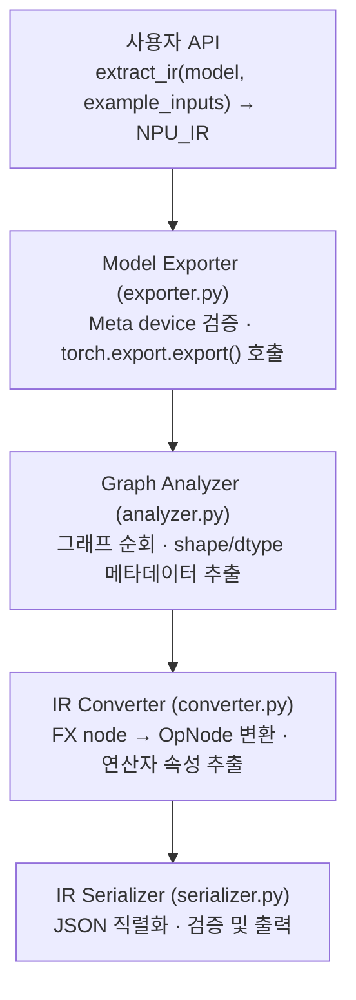
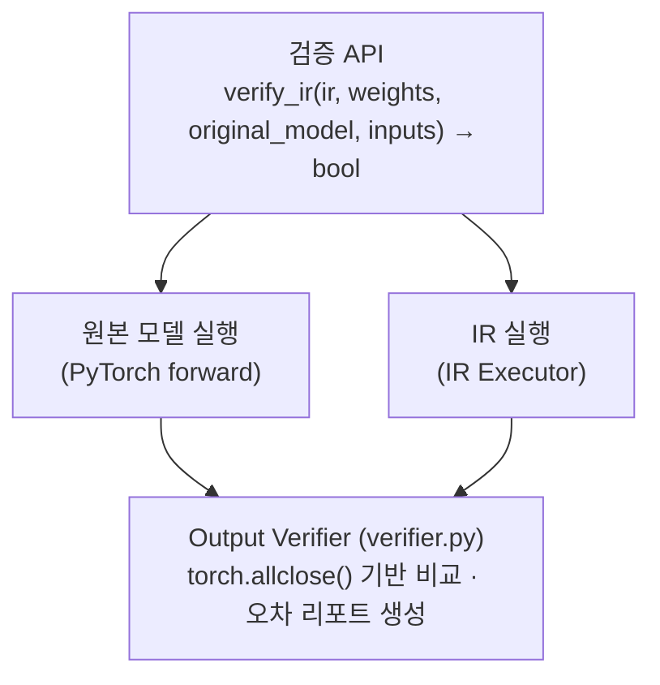

# 개념 및 아키텍처

이 문서는 NPU IR 프레임워크의 핵심 개념과 설계 철학을 설명합니다.

## 1. 개요

### 1.1 목적

NPU IR 프레임워크는 PyTorch 모델에서 NPU 컴파일러가 사용할 수 있는 중간 표현(IR)을 추출합니다. 핵심 목표는 다음과 같습니다:

- **Weight-free 추출**: 실제 weight 값 없이 그래프 구조와 shape/dtype 메타데이터만 추출
- **표준화된 표현**: ATen 레벨의 저수준 연산으로 분해된 일관된 IR
- **검증 가능성**: IR의 정확성을 원본 모델과 비교하여 검증

### 1.2 왜 Weight-free인가?

대규모 모델(LLM 등)의 경우 weight가 수십~수백 GB에 달할 수 있습니다. IR 추출 단계에서는 그래프 구조와 텐서 메타데이터만 필요하므로, weight를 로드하지 않으면:

- 메모리 사용량 대폭 절감
- IR 추출 속도 향상
- 컴파일 파이프라인의 유연성 증가

## 2. 핵심 개념

### 2.1 Meta Tensor

PyTorch의 meta device는 shape와 dtype 정보만 가지고 실제 데이터는 없는 "가짜" 텐서를 생성합니다.

```python
# Meta tensor 생성
t = torch.randn(1, 3, 224, 224, device='meta')
print(t.shape)   # torch.Size([1, 3, 224, 224])
print(t.dtype)   # torch.float32
print(t.device)  # device(type='meta')
# t의 실제 데이터는 존재하지 않음 (메모리 0 사용)

# Meta device에서 모델 생성
with torch.device('meta'):
    model = torch.nn.Linear(1000, 1000)  # 4MB weight가 실제로 할당되지 않음
```

### 2.2 torch.export

`torch.export`는 PyTorch 2.0+에서 도입된 공식 모델 내보내기 API입니다.

**특징:**
- TorchDynamo 기반 Python bytecode 레벨 tracing
- 내부적으로 FakeTensor 사용 (meta tensor의 subclass)
- ATen 레벨의 저수준 그래프 생성
- 정적 shape 분석 및 메타데이터 자동 기록

**대안 비교:**

| 방식 | 상태 | 비고 |
|------|------|------|
| torch.export | ✅ 권장 | TorchDynamo 기반, 현재 공식 표준 |
| torch.fx.symbolic_trace | 유지 | 단순한 경우에만 사용 |
| TorchScript (torch.jit) | ❌ deprecated | 사용하지 말 것 |

### 2.3 ExportedProgram

`torch.export.export()`의 반환값으로, 다음 정보를 포함합니다:

```python
exported = torch.export.export(model, example_inputs)

exported.graph_module      # torch.fx.GraphModule (그래프 표현)
exported.graph_signature   # 입출력 및 파라미터 정보
exported.state_dict        # 파라미터 (meta tensor면 shape만)
```

### 2.4 NPU_IR 구조

프레임워크에서 정의한 IR 데이터 구조입니다. 상세 API는 [IR 데이터 구조 레퍼런스](api/ir.md)를 참고하세요.

```python
@dataclass
class TensorMeta:
    name: str               # 텐서 이름
    shape: Tuple[int, ...]  # Shape 정보
    dtype: str              # "float32", "float16" 등

@dataclass
class OpNode:
    name: str                   # 노드 고유 이름
    op_type: str                # "aten.conv2d.default" 등
    inputs: List[TensorMeta]    # 입력 텐서 메타데이터
    outputs: List[TensorMeta]   # 출력 텐서 메타데이터
    attrs: Dict[str, Any]       # 연산 속성 (kernel_size 등)

@dataclass
class NPU_IR:
    nodes: List[OpNode]              # 연산 노드 리스트
    graph_inputs: List[TensorMeta]   # 그래프 입력
    graph_outputs: List[TensorMeta]  # 그래프 출력
    weights: List[TensorMeta]        # Weight 메타데이터
    weight_name_mapping: Dict[str, str]  # placeholder → state_dict 키 매핑
    model_name: str
    pytorch_version: str
```

## 3. 아키텍처

### 3.1 IR 추출 파이프라인



### 3.2 IR 실행 및 검증 파이프라인



### 3.3 컴포넌트 설명

| 컴포넌트 | 파일 | 역할 |
|---------|------|------|
| Exporter | `exporter.py` | torch.export 래핑, meta device 검증 |
| Analyzer | `analyzer.py` | FX 그래프 분석, 메타데이터 추출, schema 기반 속성 추출 |
| Converter | `converter.py` | FX node → OpNode 변환 (기본 변환기로 모든 op 처리) |
| Serializer | `serializer.py` | JSON 직렬화/역직렬화 |
| Executor | `executor.py` | IR 그래프 실행 — ATen fallback으로 모든 ATen op 자동 실행 |
| Weight Loader | `weight_loader.py` | .pt, .safetensors 파일 로드 |
| Verifier | `verifier.py` | 원본 vs IR 출력 비교 |
| Registry | `ops/registry.py` | 커스텀 연산자 등록 메커니즘 |
| ATen Ops | `ops/aten_ops.py` | op 타입 문자열 정규화 유틸리티 |
| ATen Impl | `ops/aten_impl.py` | non-ATen op 실행 (getitem만 해당) |

## 4. 설계 결정

### 4.1 ATen 레벨 IR

torch.export는 기본적으로 ATen 레벨로 분해합니다. 이는 다음과 같은 장점이 있습니다:

- **일관성**: 다양한 고수준 API가 동일한 저수준 연산으로 변환
- **완전성**: 모든 연산이 명시적으로 표현
- **NPU 친화적**: NPU 컴파일러가 최적화하기 좋은 수준

예시:
```python
# nn.Linear(10, 5)(x)는 다음으로 분해:
# - aten.linear.default 또는
# - aten.addmm.default (bias 있는 경우)
```

### 4.2 Schema 기반 ATen Fallback

모든 ATen op은 PyTorch의 op schema를 자동으로 참조하여 실행됩니다:

1. **IR 변환**: `_default_conversion()`이 모든 op을 `OpNode`로 변환 (커스텀 변환 불필요)
2. **실행**: `_aten_fallback()`이 `torch.ops.aten.*`을 직접 호출 (schema 기반 인자 재구성)

이 설계 덕분에 새로운 ATen op이 추가되어도 프레임워크 코드 변경 없이 자동 지원됩니다.

### 4.3 커스텀 연산자 레지스트리

non-ATen op이나 특수한 변환/실행이 필요한 경우에만 수동 등록합니다:

```python
from npu_ir.ops import register_executor

# non-ATen op의 실행 함수 등록
@register_executor("my_custom_op")
def execute_my_op(inputs, attrs):
    return [result_tensor]
```

### 4.3 Weight 이름 매핑

torch.export는 파라미터에 `p_` prefix를 사용합니다:
- FX 그래프: `p_layer_weight`, `p_layer_bias`
- state_dict: `layer.weight`, `layer.bias`

`weight_name_mapping`이 이 변환을 처리합니다.

## 5. 제한 사항

### 5.1 지원하지 않는 패턴

- **Dynamic shapes**: `SymInt` 차원이 포함된 모델 (정적 shape만 지원)
- **Dynamic control flow**: 데이터 의존적 if/for문
- **일부 custom autograd function**
- **복잡한 Python 동작**: list comprehension, 동적 attribute 등
- **Meta device 상수**: `forward()`에서 `torch.tensor(...)`로 생성한 상수 (meta device에서 데이터 없음)

### 5.2 권장 사항

1. 모델은 반드시 `eval()` 모드로 설정
2. 입력 모델과 example inputs 모두 meta device 사용
3. 검증 시 동일한 입력으로 테스트
4. `forward()`에서 텐서 상수 생성 대신 `self.register_buffer()` 사용
