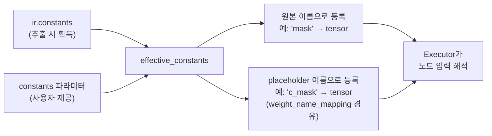

# Lifted Tensor Constants

## Lifted Tensor란?

`torch.export`가 모델을 트레이싱할 때, parameter(`nn.Parameter`)나 buffer(`register_buffer`)로
등록되지 **않은** 텐서 속성을 만나게 됩니다. `self.mask = torch.tensor([1, 0, 1, 0])` 같은
일반 Python 텐서 속성이 이에 해당합니다.

이 텐서들은 `parameters()`에도, `buffers()`에도 포함되지 않기 때문에, `torch.export`는 이를
그래프 시그니처의 `inputs_to_lifted_tensor_constants`로 **리프트(lift)** 합니다. IR에서는 다음과 같이 나타납니다:

- `c_` 접두사가 붙은 placeholder (예: `c_mask`, `c_indices`)
- `weight_name_mapping`에 placeholder → 원본 속성명 매핑
- `weights` 리스트에 shape/dtype 메타데이터
- `constants` 딕셔너리에 실제 값 (real device 모델에서 추출한 경우)

## Buffer, Parameter와의 차이

```python
class MyModel(nn.Module):
    def __init__(self):
        super().__init__()
        self.linear = nn.Linear(4, 4)                          # parameter  → p_ 접두사
        self.register_buffer('scale', torch.tensor([2.0] * 4)) # buffer     → b_ 접두사
        self.offset = torch.tensor([0.1, 0.2, 0.3, 0.4])      # lifted     → c_ 접두사
```

| 종류 | `torch.export` 시그니처 | Placeholder 접두사 | `state_dict()`에 포함? | `ir.constants`에 포함? |
|------|--------------------------|-------------------|--------------------|--------------------|
| Parameter | `inputs_to_parameters` | `p_` | Yes | No |
| Buffer | `inputs_to_buffers` | `b_` | Yes | No |
| **Lifted constant** | `inputs_to_lifted_tensor_constants` | `c_` | **No** | **Yes** |

!!! warning "핵심 차이점"
    Lifted constant는 `model.state_dict()`에 **포함되지 않습니다**.
    값은 `ir.constants`에서 가져오거나 `constants` 파라미터로 외부 제공해야 합니다.

## 예제

### MaskedLinear — Float 마스크

Linear 출력에 고정 마스크 `[1, 0, 1, 0]`을 곱하는 모델입니다.

=== "PyTorch 소스 코드"

    ```python
    import torch
    import torch.nn as nn
    from torch_ir import extract_ir

    class MaskedLinear(nn.Module):
        def __init__(self):
            super().__init__()
            self.linear = nn.Linear(4, 4)
            self.mask = torch.tensor([1.0, 0.0, 1.0, 0.0])  # lifted constant

        def forward(self, x):
            return self.linear(x) * self.mask

    model = MaskedLinear()
    model.eval()
    ir = extract_ir(model, (torch.randn(1, 4),),
                    model_name="MaskedLinear", strict=False)

    print(f"constants: {ir.constants}")
    # constants: {'mask': tensor([1., 0., 1., 0.])}
    print(f"mapping:   {ir.weight_name_mapping}")
    # mapping:   {'p_linear_weight': 'linear.weight', 'p_linear_bias': 'linear.bias', 'c_mask': 'mask'}
    ```

=== "JSON IR 출력"

    하단의 `"constants"` 섹션과 노드 내 `c_mask` placeholder에 주목하세요.

    ```json
    {
      "model_name": "MaskedLinear",
      "graph_inputs": [
        {"name": "x", "shape": [1, 4], "dtype": "float32"}
      ],
      "graph_outputs": [
        {"name": "mul", "shape": [1, 4], "dtype": "float32"}
      ],
      "weights": [
        {"name": "linear.weight", "shape": [4, 4], "dtype": "float32"},
        {"name": "linear.bias", "shape": [4], "dtype": "float32"},
        {"name": "mask", "shape": [4], "dtype": "float32"}
      ],
      "weight_name_mapping": {
        "p_linear_weight": "linear.weight",
        "p_linear_bias": "linear.bias",
        "c_mask": "mask"
      },
      "nodes": [
        {
          "name": "linear",
          "op_type": "aten.linear.default",
          "inputs": [
            {"name": "x", "shape": [1, 4], "dtype": "float32",
             "producer_node": "x", "producer_output_idx": 0},
            {"name": "p_linear_weight", "shape": [4, 4], "dtype": "float32"},
            {"name": "p_linear_bias", "shape": [4], "dtype": "float32"}
          ],
          "outputs": [
            {"name": "linear", "shape": [1, 4], "dtype": "float32"}
          ],
          "attrs": {}
        },
        {
          "name": "mul",
          "op_type": "aten.mul.Tensor",
          "inputs": [
            {"name": "linear", "shape": [1, 4], "dtype": "float32",
             "producer_node": "linear", "producer_output_idx": 0},
            {"name": "c_mask", "shape": [4], "dtype": "float32"}
          ],
          "outputs": [
            {"name": "mul", "shape": [1, 4], "dtype": "float32"}
          ],
          "attrs": {}
        }
      ],
      "constants": {
        "mask": {"data": [1.0, 0.0, 1.0, 0.0], "dtype": "float32"}
      }
    }
    ```

=== "IR 그래프 시각화"

    Lifted constant `c_mask`가 weight와 동일하게 점선 엣지의 평행사변형으로 표시됩니다.

    ```mermaid
    flowchart TD
        input_x[/"Input: x<br/>1x4"/]
        op_linear["linear<br/>1x4"]
        input_x -->|"1x4"| op_linear
        w_p_linear_weight[/"p_linear_weight<br/>4x4"/]
        w_p_linear_weight -.->|"4x4"| op_linear
        w_p_linear_bias[/"p_linear_bias<br/>4"/]
        w_p_linear_bias -.->|"4"| op_linear
        op_mul["mul.Tensor<br/>1x4"]
        op_linear -->|"1x4"| op_mul
        w_c_mask[/"c_mask<br/>4"/]
        w_c_mask -.->|"4"| op_mul
        output_0[\"Output<br/>1x4"/]
        op_mul --> output_0
    ```

### GatherWithIndex — 정수 인덱스 텐서

Linear 출력에서 인덱스 텐서로 특정 컬럼을 선택하는 모델입니다.

=== "PyTorch 소스 코드"

    ```python
    class GatherWithIndex(nn.Module):
        def __init__(self):
            super().__init__()
            self.linear = nn.Linear(8, 8)
            self.indices = torch.tensor([0, 2, 4, 6], dtype=torch.long)  # lifted constant

        def forward(self, x):
            out = self.linear(x)
            return out[:, self.indices]
    ```

=== "JSON IR 출력"

    `int64` dtype이 constants에 보존됩니다. `_tensor_list_sizes`와 `_tensor_list_none_masks`는
    `aten.index.Tensor` 실행을 위한 내부 속성입니다.

    ```json
    {
      "model_name": "GatherWithIndex",
      "graph_inputs": [
        {"name": "x", "shape": [1, 8], "dtype": "float32"}
      ],
      "graph_outputs": [
        {"name": "index", "shape": [1, 4], "dtype": "float32"}
      ],
      "weights": [
        {"name": "linear.weight", "shape": [8, 8], "dtype": "float32"},
        {"name": "linear.bias", "shape": [8], "dtype": "float32"},
        {"name": "indices", "shape": [4], "dtype": "int64"}
      ],
      "weight_name_mapping": {
        "p_linear_weight": "linear.weight",
        "p_linear_bias": "linear.bias",
        "c_indices": "indices"
      },
      "nodes": [
        {
          "name": "linear",
          "op_type": "aten.linear.default",
          "inputs": [
            {"name": "x", "shape": [1, 8], "dtype": "float32",
             "producer_node": "x", "producer_output_idx": 0},
            {"name": "p_linear_weight", "shape": [8, 8], "dtype": "float32"},
            {"name": "p_linear_bias", "shape": [8], "dtype": "float32"}
          ],
          "outputs": [
            {"name": "linear", "shape": [1, 8], "dtype": "float32"}
          ]
        },
        {
          "name": "index",
          "op_type": "aten.index.Tensor",
          "inputs": [
            {"name": "linear", "shape": [1, 8], "dtype": "float32",
             "producer_node": "linear", "producer_output_idx": 0},
            {"name": "c_indices", "shape": [4], "dtype": "int64"}
          ],
          "outputs": [
            {"name": "index", "shape": [1, 4], "dtype": "float32"}
          ]
        }
      ],
      "constants": {
        "indices": {"data": [0, 2, 4, 6], "dtype": "int64"}
      }
    }
    ```

=== "IR 그래프 시각화"

    ```mermaid
    flowchart TD
        input_x[/"Input: x<br/>1x8"/]
        op_linear["linear<br/>1x8"]
        input_x -->|"1x8"| op_linear
        w_p_linear_weight[/"p_linear_weight<br/>8x8"/]
        w_p_linear_weight -.->|"8x8"| op_linear
        w_p_linear_bias[/"p_linear_bias<br/>8"/]
        w_p_linear_bias -.->|"8"| op_linear
        op_index["index.Tensor<br/>1x4"]
        op_linear -->|"1x8"| op_index
        w_c_indices[/"c_indices<br/>4"/]
        w_c_indices -.->|"4"| op_index
        output_0[\"Output<br/>1x4"/]
        op_index --> output_0
    ```

### BufferVsConstant — Buffer와 Lifted Constant 함께 사용

`register_buffer`(scale)와 일반 속성(offset)을 **모두** 사용하는 모델입니다.
IR에서 어떻게 다르게 나타나는지 확인할 수 있습니다.

=== "PyTorch 소스 코드"

    ```python
    class BufferVsConstant(nn.Module):
        def __init__(self):
            super().__init__()
            self.linear = nn.Linear(4, 4)
            self.register_buffer('scale', torch.tensor([2.0, 2.0, 2.0, 2.0]))  # buffer
            self.offset = torch.tensor([0.1, 0.2, 0.3, 0.4])                   # lifted constant

        def forward(self, x):
            return self.linear(x) * self.scale + self.offset
    ```

=== "JSON IR 출력"

    주목할 점:

    - `b_scale` (buffer, `b_` 접두사) — `state_dict`에 포함, `constants`에 **미포함**
    - `c_offset` (lifted, `c_` 접두사) — `state_dict`에 **미포함**, `constants`에 포함

    ```json
    {
      "model_name": "BufferVsConstant",
      "weight_name_mapping": {
        "p_linear_weight": "linear.weight",
        "p_linear_bias": "linear.bias",
        "b_scale": "scale",
        "c_offset": "offset"
      },
      "nodes": [
        {
          "name": "linear", "op_type": "aten.linear.default",
          "inputs": [
            {"name": "x", "shape": [1, 4], "dtype": "float32",
             "producer_node": "x", "producer_output_idx": 0},
            {"name": "p_linear_weight", "shape": [4, 4], "dtype": "float32"},
            {"name": "p_linear_bias", "shape": [4], "dtype": "float32"}
          ],
          "outputs": [{"name": "linear", "shape": [1, 4], "dtype": "float32"}]
        },
        {
          "name": "mul", "op_type": "aten.mul.Tensor",
          "inputs": [
            {"name": "linear", "shape": [1, 4], "dtype": "float32",
             "producer_node": "linear", "producer_output_idx": 0},
            {"name": "b_scale", "shape": [4], "dtype": "float32"}
          ],
          "outputs": [{"name": "mul", "shape": [1, 4], "dtype": "float32"}]
        },
        {
          "name": "add", "op_type": "aten.add.Tensor",
          "inputs": [
            {"name": "mul", "shape": [1, 4], "dtype": "float32",
             "producer_node": "mul", "producer_output_idx": 0},
            {"name": "c_offset", "shape": [4], "dtype": "float32"}
          ],
          "outputs": [{"name": "add", "shape": [1, 4], "dtype": "float32"}]
        }
      ],
      "constants": {
        "offset": {"data": [0.1, 0.2, 0.3, 0.4], "dtype": "float32"}
      }
    }
    ```

=== "IR 그래프 시각화"

    `b_scale` (buffer)과 `c_offset` (lifted constant) 모두 점선 엣지의 평행사변형으로 표시되지만,
    접두사(`b_` vs `c_`)로 구분할 수 있습니다.

    ```mermaid
    flowchart TD
        input_x[/"Input: x<br/>1x4"/]
        op_linear["linear<br/>1x4"]
        input_x -->|"1x4"| op_linear
        w_p_linear_weight[/"p_linear_weight<br/>4x4"/]
        w_p_linear_weight -.->|"4x4"| op_linear
        w_p_linear_bias[/"p_linear_bias<br/>4"/]
        w_p_linear_bias -.->|"4"| op_linear
        op_mul["mul.Tensor<br/>1x4"]
        op_linear -->|"1x4"| op_mul
        w_b_scale[/"b_scale<br/>4"/]
        w_b_scale -.->|"4"| op_mul
        op_add["add.Tensor<br/>1x4"]
        op_mul -->|"1x4"| op_add
        w_c_offset[/"c_offset<br/>4"/]
        w_c_offset -.->|"4"| op_add
        output_0[\"Output<br/>1x4"/]
        op_add --> output_0
    ```

## Meta Device 추출과 Constants 문제

Meta device 모델에서 IR을 추출하면, lifted tensor constant도 meta device에 있어
**실제 값이 없습니다**. 프레임워크는 경고를 발생시키고 이를 필터링합니다:

```python
with torch.device('meta'):
    model = MaskedLinear()

ir = extract_ir(model, (torch.randn(1, 4, device='meta'),), strict=False)
# UserWarning: Skipping 1 meta-device constant(s)
#              (shape/dtype already in weights): ['mask']

print(ir.constants)  # {} — 비어있음!
```

!!! danger "실행 실패"
    Lifted constant는 `state_dict()`에도 없고, `ir.constants`도 비어있으므로,
    executor가 값을 찾을 수 없습니다:

    ```python
    real_model = MaskedLinear()
    execute_ir(ir, inputs, weights=real_model.state_dict())
    # ExecutionError: Weight/input 'c_mask' not found in registry for node 'mul'.
    ```

### 해결 방법: Constants 외부 제공

`execute_ir()` 또는 `verify_ir_with_state_dict()`의 `constants` 파라미터를 사용합니다:

```python
# 누락된 constant 값을 명시적으로 제공
constants = {"mask": torch.tensor([1.0, 0.0, 1.0, 0.0])}

outputs = execute_ir(
    ir, inputs,
    weights=real_model.state_dict(),
    constants=constants,  # (1)!
)
```

1. `constants` 딕셔너리는 원본 속성명(예: `"mask"`)을 텐서 값에 매핑합니다.
   Executor가 `weight_name_mapping`을 통해 `c_mask` placeholder를 자동으로 해석합니다.

검증도 동일한 방식으로 동작합니다:

```python
is_valid, report = verify_ir_with_state_dict(
    ir=ir,
    state_dict=real_model.state_dict(),
    original_model=real_model,
    test_inputs=inputs,
    constants=constants,
)
```

### 내부 동작 원리



사용자 제공 constants는 `ir.constants`를 **override**하므로, 두 경우 모두 동작합니다:

- **Meta 추출**: `ir.constants`가 비어있고, 사용자가 모든 constants를 제공
- **Real 추출**: `ir.constants`에 값이 있고, 사용자가 선택적으로 특정 값만 override 가능

## 모범 사례

!!! tip "`register_buffer` vs 일반 속성, 언제 사용할까?"
    **가능하면 `register_buffer`를 사용하세요.** Buffer는 `state_dict()`에 포함되므로,
    meta와 real device 추출 모두에서 문제없이 동작합니다.

    일반 텐서 속성은 모델의 `state_dict`에 값을 의도적으로 포함시키지 **않으려는** 경우에만
    사용하세요 (예: 고정 룩업 테이블, 하드코딩된 인덱스).

| 시나리오 | 권장 방식 |
|---------|----------|
| 고정 마스크/스케일 | `self.register_buffer('mask', tensor)` |
| 고정 인덱스 텐서 | `self.register_buffer('indices', tensor)` |
| state_dict에 저장하지 않아야 하는 값 | `self.indices = tensor` (lifted constant) |
| Meta device 추출 + lifted constant | 실행 시 `constants` 딕셔너리 제공 |

## 요약

| 단계 | `register_buffer` | Lifted constant (`self.x = tensor`) |
|------|-------------------|-------------------------------------|
| 추출 (real device) | `state_dict`에 포함 | `ir.constants`에 포함 |
| 추출 (meta device) | `state_dict`에 포함 (shape만) | **손실** (필터링됨) |
| IR placeholder 접두사 | `b_` | `c_` |
| JSON 직렬화 | `constants`에 미포함 | `constants` 딕셔너리에 포함 |
| 실행 시 값 출처 | `weights` dict (state_dict) | `ir.constants` 또는 `constants` 파라미터 |
