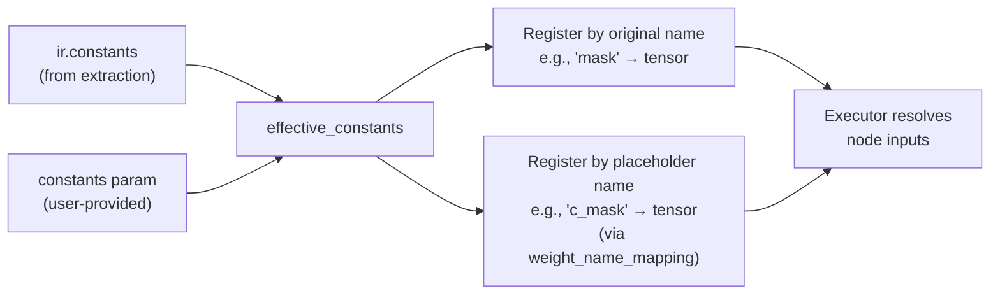

# Lifted Tensor Constants

## What Is a Lifted Tensor?

When `torch.export` traces a model, it encounters tensor attributes that are **not** registered as
parameters (`nn.Parameter`) or buffers (`register_buffer`). These are plain Python tensor attributes
such as `self.mask = torch.tensor([1, 0, 1, 0])`.

Because these tensors are neither in `parameters()` nor in `buffers()`, `torch.export` **lifts** them
into the graph signature as `inputs_to_lifted_tensor_constants`. In the IR they appear as:

- A placeholder prefixed with `c_` (e.g., `c_mask`, `c_indices`)
- An entry in `weight_name_mapping` mapping the placeholder to the original attribute name
- Shape/dtype metadata in the `weights` list
- Actual values in the `constants` dict (when extracted from a real-device model)

## How It Differs from Buffers and Parameters

```python
class MyModel(nn.Module):
    def __init__(self):
        super().__init__()
        self.linear = nn.Linear(4, 4)                          # parameter  → p_ prefix
        self.register_buffer('scale', torch.tensor([2.0] * 4)) # buffer     → b_ prefix
        self.offset = torch.tensor([0.1, 0.2, 0.3, 0.4])      # lifted     → c_ prefix
```

| Kind | `torch.export` signature | Placeholder prefix | In `state_dict()`? | In `ir.constants`? |
|------|--------------------------|-------------------|--------------------|--------------------|
| Parameter | `inputs_to_parameters` | `p_` | Yes | No |
| Buffer | `inputs_to_buffers` | `b_` | Yes | No |
| **Lifted constant** | `inputs_to_lifted_tensor_constants` | `c_` | **No** | **Yes** |

!!! warning "Key difference"
    Lifted constants are **not** included in `model.state_dict()`.
    Their values must come from `ir.constants` or be provided externally via the `constants` parameter.

## Examples

### MaskedLinear — Float Mask

A model that multiplies linear output by a static mask `[1, 0, 1, 0]`.

=== "PyTorch Source Code"

    ```python
    import torch
    import torch.nn as nn
    from torch_ir import extract_ir

    class MaskedLinear(nn.Module):
        def __init__(self):
            super().__init__()
            self.linear = nn.Linear(4, 4)
            self.mask = torch.tensor([1.0, 0.0, 1.0, 0.0])  # lifted constant

        def forward(self, x):
            return self.linear(x) * self.mask

    model = MaskedLinear()
    model.eval()
    ir = extract_ir(model, (torch.randn(1, 4),),
                    model_name="MaskedLinear", strict=False)

    print(f"constants: {ir.constants}")
    # constants: {'mask': tensor([1., 0., 1., 0.])}
    print(f"mapping:   {ir.weight_name_mapping}")
    # mapping:   {'p_linear_weight': 'linear.weight', 'p_linear_bias': 'linear.bias', 'c_mask': 'mask'}
    ```

=== "JSON IR Output"

    Note the `"constants"` section at the bottom and the `c_mask` placeholder in nodes.

    ```json
    {
      "model_name": "MaskedLinear",
      "graph_inputs": [
        {"name": "x", "shape": [1, 4], "dtype": "float32"}
      ],
      "graph_outputs": [
        {"name": "mul", "shape": [1, 4], "dtype": "float32"}
      ],
      "weights": [
        {"name": "linear.weight", "shape": [4, 4], "dtype": "float32"},
        {"name": "linear.bias", "shape": [4], "dtype": "float32"},
        {"name": "mask", "shape": [4], "dtype": "float32"}
      ],
      "weight_name_mapping": {
        "p_linear_weight": "linear.weight",
        "p_linear_bias": "linear.bias",
        "c_mask": "mask"
      },
      "nodes": [
        {
          "name": "linear",
          "op_type": "aten.linear.default",
          "inputs": [
            {"name": "x", "shape": [1, 4], "dtype": "float32",
             "producer_node": "x", "producer_output_idx": 0},
            {"name": "p_linear_weight", "shape": [4, 4], "dtype": "float32"},
            {"name": "p_linear_bias", "shape": [4], "dtype": "float32"}
          ],
          "outputs": [
            {"name": "linear", "shape": [1, 4], "dtype": "float32"}
          ],
          "attrs": {}
        },
        {
          "name": "mul",
          "op_type": "aten.mul.Tensor",
          "inputs": [
            {"name": "linear", "shape": [1, 4], "dtype": "float32",
             "producer_node": "linear", "producer_output_idx": 0},
            {"name": "c_mask", "shape": [4], "dtype": "float32"}
          ],
          "outputs": [
            {"name": "mul", "shape": [1, 4], "dtype": "float32"}
          ],
          "attrs": {}
        }
      ],
      "constants": {
        "mask": {"data": [1.0, 0.0, 1.0, 0.0], "dtype": "float32"}
      }
    }
    ```

=== "IR Graph Visualization"

    The lifted constant `c_mask` appears as a weight-like parallelogram with a dashed edge.

    ```mermaid
    flowchart TD
        input_x[/"Input: x<br/>1x4"/]
        op_linear["linear<br/>1x4"]
        input_x -->|"1x4"| op_linear
        w_p_linear_weight[/"p_linear_weight<br/>4x4"/]
        w_p_linear_weight -.->|"4x4"| op_linear
        w_p_linear_bias[/"p_linear_bias<br/>4"/]
        w_p_linear_bias -.->|"4"| op_linear
        op_mul["mul.Tensor<br/>1x4"]
        op_linear -->|"1x4"| op_mul
        w_c_mask[/"c_mask<br/>4"/]
        w_c_mask -.->|"4"| op_mul
        output_0[\"Output<br/>1x4"/]
        op_mul --> output_0
    ```

### GatherWithIndex — Integer Index Tensor

A model that selects specific columns from the linear output using an index tensor.

=== "PyTorch Source Code"

    ```python
    class GatherWithIndex(nn.Module):
        def __init__(self):
            super().__init__()
            self.linear = nn.Linear(8, 8)
            self.indices = torch.tensor([0, 2, 4, 6], dtype=torch.long)  # lifted constant

        def forward(self, x):
            out = self.linear(x)
            return out[:, self.indices]
    ```

=== "JSON IR Output"

    The `int64` dtype is preserved in constants. `_tensor_list_sizes` and `_tensor_list_none_masks`
    are internal attrs used by the executor for `aten.index.Tensor`.

    ```json
    {
      "model_name": "GatherWithIndex",
      "graph_inputs": [
        {"name": "x", "shape": [1, 8], "dtype": "float32"}
      ],
      "graph_outputs": [
        {"name": "index", "shape": [1, 4], "dtype": "float32"}
      ],
      "weights": [
        {"name": "linear.weight", "shape": [8, 8], "dtype": "float32"},
        {"name": "linear.bias", "shape": [8], "dtype": "float32"},
        {"name": "indices", "shape": [4], "dtype": "int64"}
      ],
      "weight_name_mapping": {
        "p_linear_weight": "linear.weight",
        "p_linear_bias": "linear.bias",
        "c_indices": "indices"
      },
      "nodes": [
        {
          "name": "linear",
          "op_type": "aten.linear.default",
          "inputs": [
            {"name": "x", "shape": [1, 8], "dtype": "float32",
             "producer_node": "x", "producer_output_idx": 0},
            {"name": "p_linear_weight", "shape": [8, 8], "dtype": "float32"},
            {"name": "p_linear_bias", "shape": [8], "dtype": "float32"}
          ],
          "outputs": [
            {"name": "linear", "shape": [1, 8], "dtype": "float32"}
          ]
        },
        {
          "name": "index",
          "op_type": "aten.index.Tensor",
          "inputs": [
            {"name": "linear", "shape": [1, 8], "dtype": "float32",
             "producer_node": "linear", "producer_output_idx": 0},
            {"name": "c_indices", "shape": [4], "dtype": "int64"}
          ],
          "outputs": [
            {"name": "index", "shape": [1, 4], "dtype": "float32"}
          ]
        }
      ],
      "constants": {
        "indices": {"data": [0, 2, 4, 6], "dtype": "int64"}
      }
    }
    ```

=== "IR Graph Visualization"

    ```mermaid
    flowchart TD
        input_x[/"Input: x<br/>1x8"/]
        op_linear["linear<br/>1x8"]
        input_x -->|"1x8"| op_linear
        w_p_linear_weight[/"p_linear_weight<br/>8x8"/]
        w_p_linear_weight -.->|"8x8"| op_linear
        w_p_linear_bias[/"p_linear_bias<br/>8"/]
        w_p_linear_bias -.->|"8"| op_linear
        op_index["index.Tensor<br/>1x4"]
        op_linear -->|"1x8"| op_index
        w_c_indices[/"c_indices<br/>4"/]
        w_c_indices -.->|"4"| op_index
        output_0[\"Output<br/>1x4"/]
        op_index --> output_0
    ```

### BufferVsConstant — Buffer and Lifted Constant Together

A model that uses **both** `register_buffer` (scale) and a plain attribute (offset),
demonstrating how they appear differently in the IR.

=== "PyTorch Source Code"

    ```python
    class BufferVsConstant(nn.Module):
        def __init__(self):
            super().__init__()
            self.linear = nn.Linear(4, 4)
            self.register_buffer('scale', torch.tensor([2.0, 2.0, 2.0, 2.0]))  # buffer
            self.offset = torch.tensor([0.1, 0.2, 0.3, 0.4])                   # lifted constant

        def forward(self, x):
            return self.linear(x) * self.scale + self.offset
    ```

=== "JSON IR Output"

    Notice:

    - `b_scale` (buffer, `b_` prefix) — in `state_dict`, **not** in `constants`
    - `c_offset` (lifted, `c_` prefix) — **not** in `state_dict`, in `constants`

    ```json
    {
      "model_name": "BufferVsConstant",
      "weight_name_mapping": {
        "p_linear_weight": "linear.weight",
        "p_linear_bias": "linear.bias",
        "b_scale": "scale",
        "c_offset": "offset"
      },
      "nodes": [
        {
          "name": "linear", "op_type": "aten.linear.default",
          "inputs": [
            {"name": "x", "shape": [1, 4], "dtype": "float32",
             "producer_node": "x", "producer_output_idx": 0},
            {"name": "p_linear_weight", "shape": [4, 4], "dtype": "float32"},
            {"name": "p_linear_bias", "shape": [4], "dtype": "float32"}
          ],
          "outputs": [{"name": "linear", "shape": [1, 4], "dtype": "float32"}]
        },
        {
          "name": "mul", "op_type": "aten.mul.Tensor",
          "inputs": [
            {"name": "linear", "shape": [1, 4], "dtype": "float32",
             "producer_node": "linear", "producer_output_idx": 0},
            {"name": "b_scale", "shape": [4], "dtype": "float32"}
          ],
          "outputs": [{"name": "mul", "shape": [1, 4], "dtype": "float32"}]
        },
        {
          "name": "add", "op_type": "aten.add.Tensor",
          "inputs": [
            {"name": "mul", "shape": [1, 4], "dtype": "float32",
             "producer_node": "mul", "producer_output_idx": 0},
            {"name": "c_offset", "shape": [4], "dtype": "float32"}
          ],
          "outputs": [{"name": "add", "shape": [1, 4], "dtype": "float32"}]
        }
      ],
      "constants": {
        "offset": {"data": [0.1, 0.2, 0.3, 0.4], "dtype": "float32"}
      }
    }
    ```

=== "IR Graph Visualization"

    `b_scale` (buffer) and `c_offset` (lifted constant) both appear as dashed-edge
    parallelograms, but their prefixes (`b_` vs `c_`) reveal the difference.

    ```mermaid
    flowchart TD
        input_x[/"Input: x<br/>1x4"/]
        op_linear["linear<br/>1x4"]
        input_x -->|"1x4"| op_linear
        w_p_linear_weight[/"p_linear_weight<br/>4x4"/]
        w_p_linear_weight -.->|"4x4"| op_linear
        w_p_linear_bias[/"p_linear_bias<br/>4"/]
        w_p_linear_bias -.->|"4"| op_linear
        op_mul["mul.Tensor<br/>1x4"]
        op_linear -->|"1x4"| op_mul
        w_b_scale[/"b_scale<br/>4"/]
        w_b_scale -.->|"4"| op_mul
        op_add["add.Tensor<br/>1x4"]
        op_mul -->|"1x4"| op_add
        w_c_offset[/"c_offset<br/>4"/]
        w_c_offset -.->|"4"| op_add
        output_0[\"Output<br/>1x4"/]
        op_add --> output_0
    ```

## Meta Device Extraction and the Constants Problem

When extracting IR from a meta-device model, lifted tensor constants are also on the meta device
and contain **no actual values**. The framework filters them out with a warning:

```python
with torch.device('meta'):
    model = MaskedLinear()

ir = extract_ir(model, (torch.randn(1, 4, device='meta'),), strict=False)
# UserWarning: Skipping 1 meta-device constant(s)
#              (shape/dtype already in weights): ['mask']

print(ir.constants)  # {} — empty!
```

!!! danger "Execution will fail"
    Since lifted constants are **not** in `state_dict()` and `ir.constants` is empty,
    the executor cannot find the constant values:

    ```python
    real_model = MaskedLinear()
    execute_ir(ir, inputs, weights=real_model.state_dict())
    # ExecutionError: Weight/input 'c_mask' not found in registry for node 'mul'.
    ```

### Solution: Provide Constants Externally

Use the `constants` parameter in `execute_ir()` or `verify_ir_with_state_dict()`:

```python
# Provide the missing constant values explicitly
constants = {"mask": torch.tensor([1.0, 0.0, 1.0, 0.0])}

outputs = execute_ir(
    ir, inputs,
    weights=real_model.state_dict(),
    constants=constants,  # (1)!
)
```

1. The `constants` dict maps original attribute names (e.g., `"mask"`) to their tensor values.
   The executor automatically resolves the `c_mask` placeholder through `weight_name_mapping`.

Verification works the same way:

```python
is_valid, report = verify_ir_with_state_dict(
    ir=ir,
    state_dict=real_model.state_dict(),
    original_model=real_model,
    test_inputs=inputs,
    constants=constants,
)
```

### How It Works Internally



User-provided constants **override** `ir.constants`, so this works for both:

- **Meta extraction**: `ir.constants` is empty, user provides all constants
- **Real extraction**: `ir.constants` has values, user can optionally override specific ones

## Best Practices

!!! tip "When to use `register_buffer` vs plain attributes"
    **Prefer `register_buffer`** whenever possible. Buffers are included in `state_dict()`,
    so they work seamlessly with both meta and real-device extraction.

    Use plain tensor attributes only when you intentionally want to keep values
    **outside** of the model's `state_dict` (e.g., fixed lookup tables, hard-coded indices).

| Scenario | Recommendation |
|----------|---------------|
| Static mask/scale | `self.register_buffer('mask', tensor)` |
| Fixed index tensor | `self.register_buffer('indices', tensor)` |
| Value that must NOT be saved/loaded | `self.indices = tensor` (lifted constant) |
| Meta device extraction + lifted constant | Provide `constants` dict at execution time |

## Summary

| Stage | `register_buffer` | Lifted constant (`self.x = tensor`) |
|-------|-------------------|-------------------------------------|
| Extraction (real) | In `state_dict` | In `ir.constants` |
| Extraction (meta) | In `state_dict` (shapes only) | **Lost** (filtered out) |
| IR placeholder prefix | `b_` | `c_` |
| JSON serialization | Not in `constants` | In `constants` dict |
| Execution source | `weights` dict (state_dict) | `ir.constants` or `constants` param |
