# 사용 가이드

이 문서는 IR 추출 프레임워크의 상세 사용법을 설명합니다.

## 1. 기본 워크플로우

### 1.1 IR 추출 기본 흐름

```python
import torch
import torch.nn as nn
from torch_ir import extract_ir

# 1. 모델 정의
class MyModel(nn.Module):
    def __init__(self):
        super().__init__()
        self.conv = nn.Conv2d(3, 64, 3, padding=1)
        self.bn = nn.BatchNorm2d(64)
        self.relu = nn.ReLU()
        self.fc = nn.Linear(64 * 32 * 32, 10)

    def forward(self, x):
        x = self.relu(self.bn(self.conv(x)))
        x = x.flatten(1)
        return self.fc(x)

# 2. Meta device에서 모델 생성
with torch.device('meta'):
    model = MyModel()

# 3. 모델을 eval 모드로 설정 (중요!)
model.eval()

# 4. Example inputs 준비
example_inputs = (torch.randn(1, 3, 32, 32, device='meta'),)

# 5. IR 추출
ir = extract_ir(model, example_inputs, model_name="MyModel")

# 6. 결과 확인
print(ir)
```

### 1.2 중요 사항

- **eval() 모드**: BatchNorm, Dropout 등이 올바르게 동작하려면 필수
- **meta device**: 모델과 inputs 모두 meta device에 있어야 함
- **정적 shape**: 동적 shape는 지원하지 않음

## 2. IR 분석

### 2.1 IR 구조 탐색

```python
# IR 기본 정보
print(f"Model: {ir.model_name}")
print(f"PyTorch version: {ir.pytorch_version}")
print(f"Total nodes: {len(ir.nodes)}")
print(f"Total weights: {len(ir.weights)}")

# 그래프 입출력
print("\nGraph Inputs:")
for inp in ir.graph_inputs:
    print(f"  {inp.name}: shape={inp.shape}, dtype={inp.dtype}")

print("\nGraph Outputs:")
for out in ir.graph_outputs:
    print(f"  {out.name}: shape={out.shape}, dtype={out.dtype}")
```

### 2.2 노드 분석

```python
# 모든 노드 순회
for node in ir.nodes:
    print(f"\nNode: {node.name}")
    print(f"  Op type: {node.op_type}")
    print(f"  Inputs:")
    for inp in node.inputs:
        print(f"    - {inp.name}: {inp.shape}")
    print(f"  Outputs:")
    for out in node.outputs:
        print(f"    - {out.name}: {out.shape}")
    if node.attrs:
        print(f"  Attrs: {node.attrs}")
```

### 2.3 연산자 통계

```python
from collections import Counter

# 연산자 종류별 개수
op_counts = Counter(node.op_type for node in ir.nodes)

print("Operation counts:")
for op_type, count in op_counts.most_common():
    print(f"  {op_type}: {count}")
```

### 2.4 Weight 정보

```python
# Weight 메타데이터
print("Weights:")
for weight in ir.weights:
    print(f"  {weight.name}: shape={weight.shape}, dtype={weight.dtype}")

# Weight 이름 매핑 (placeholder → state_dict key)
print("\nWeight name mapping:")
for placeholder, sd_key in ir.weight_name_mapping.items():
    print(f"  {placeholder} → {sd_key}")
```

## 3. IR 저장 및 로드

### 3.1 JSON 파일로 저장

```python
# 저장
ir.save("model_ir.json")

# 또는 serializer 사용
from torch_ir import save_ir, serialize_ir

save_ir(ir, "model_ir.json")

# JSON 문자열로 직렬화
json_str = serialize_ir(ir)
```

### 3.2 JSON 파일에서 로드

```python
from torch_ir import load_ir, deserialize_ir

# 파일에서 로드
loaded_ir = load_ir("model_ir.json")

# 또는 IR.load() 사용
from torch_ir import IR
loaded_ir = IR.load("model_ir.json")

# JSON 문자열에서 역직렬화
ir = deserialize_ir(json_str)
```

### 3.3 IR 검증

```python
from torch_ir import validate_ir

# IR 구조 검증
try:
    validate_ir(ir)
    print("IR is valid")
except Exception as e:
    print(f"IR validation failed: {e}")
```

## 4. IR 실행 및 검증

### 4.1 IR 실행

IR을 실제 weight와 함께 실행하여 결과를 얻을 수 있습니다.

```python
from torch_ir import IRExecutor, execute_ir

# 원본 모델에서 weight 가져오기
original_model = MyModel()
original_model.load_state_dict(torch.load('weights.pt'))
state_dict = original_model.state_dict()

# 방법 1: IRExecutor 사용
executor = IRExecutor(ir)
executor.load_weights_from_state_dict(state_dict)

test_input = torch.randn(1, 3, 32, 32)
outputs = executor.execute((test_input,))

# 방법 2: execute_ir 함수 사용
outputs = execute_ir(ir, (test_input,), weights=state_dict)

print(f"Output shape: {outputs[0].shape}")
```

### 4.2 원본 모델과 비교 검증

```python
from torch_ir import verify_ir_with_state_dict, verify_ir

# 원본 모델 준비
original_model = MyModel()
original_model.load_state_dict(torch.load('weights.pt'))
original_model.eval()

# 테스트 입력
test_inputs = (torch.randn(1, 3, 32, 32),)

# 검증 (state_dict 사용)
is_valid, report = verify_ir_with_state_dict(
    ir=ir,
    state_dict=original_model.state_dict(),
    original_model=original_model,
    test_inputs=test_inputs,
    rtol=1e-5,  # 상대 오차 허용치
    atol=1e-5,  # 절대 오차 허용치
)

print(f"Verification: {'PASSED' if is_valid else 'FAILED'}")
print(report)

# 검증 (파일 경로 사용)
torch.save(original_model.state_dict(), 'weights.pt')
is_valid, report = verify_ir(
    ir=ir,
    weights_path='weights.pt',
    original_model=original_model,
    test_inputs=test_inputs,
)
```

### 4.3 검증 결과 분석

```python
if not is_valid:
    print(f"Max difference: {report.max_diff}")
    print(f"Mean difference: {report.mean_diff}")
    print(f"Error message: {report.error_message}")

    # 개별 출력 분석
    for detail in report.output_details:
        print(f"  Output {detail['index']}: "
              f"shape={detail['shape']}, "
              f"is_close={detail['is_close']}, "
              f"max_diff={detail['max_diff']:.2e}")
```

## 5. 다양한 모델 타입

### 5.1 CNN 모델

```python
import torchvision.models as models

# Meta device에서 ResNet 생성
with torch.device('meta'):
    model = models.resnet18()
model.eval()

inputs = (torch.randn(1, 3, 224, 224, device='meta'),)
ir = extract_ir(model, inputs, model_name="ResNet18")

print(f"ResNet18 IR: {len(ir.nodes)} nodes, {len(ir.weights)} weights")
```

### 5.2 Sequential 모델

```python
with torch.device('meta'):
    model = nn.Sequential(
        nn.Linear(784, 256),
        nn.ReLU(),
        nn.Dropout(0.2),
        nn.Linear(256, 128),
        nn.ReLU(),
        nn.Linear(128, 10),
    )
model.eval()

inputs = (torch.randn(1, 784, device='meta'),)
ir = extract_ir(model, inputs, model_name="MLP")
```

### 5.3 Transformer 모델

```python
with torch.device('meta'):
    encoder_layer = nn.TransformerEncoderLayer(d_model=512, nhead=8)
    model = nn.TransformerEncoder(encoder_layer, num_layers=6)
model.eval()

inputs = (torch.randn(10, 1, 512, device='meta'),)  # (seq_len, batch, d_model)
ir = extract_ir(model, inputs, model_name="TransformerEncoder")
```

### 5.4 다중 입력 모델

```python
class MultiInputModel(nn.Module):
    def __init__(self):
        super().__init__()
        self.fc1 = nn.Linear(10, 20)
        self.fc2 = nn.Linear(5, 20)
        self.fc3 = nn.Linear(40, 10)

    def forward(self, x1, x2):
        h1 = self.fc1(x1)
        h2 = self.fc2(x2)
        return self.fc3(torch.cat([h1, h2], dim=1))

with torch.device('meta'):
    model = MultiInputModel()
model.eval()

inputs = (
    torch.randn(1, 10, device='meta'),
    torch.randn(1, 5, device='meta'),
)
ir = extract_ir(model, inputs)
```

## 6. Weight 관리

### 6.1 Weight 로드

```python
from torch_ir import load_weights, load_weights_pt, load_weights_safetensors

# 자동 포맷 감지
weights = load_weights('model.pt')

# 특정 포맷 지정
weights = load_weights_pt('model.pt')
weights = load_weights_safetensors('model.safetensors')
```

### 6.2 Weight 검증

```python
from torch_ir.weight_loader import validate_weights_against_ir

# Weight가 IR과 일치하는지 검증
errors = validate_weights_against_ir(weights, ir)
if errors:
    print("Weight validation errors:")
    for error in errors:
        print(f"  - {error}")
else:
    print("Weights are valid")
```

## 7. 고급 사용법

### 7.1 Strict 모드

```python
# Strict 모드: 변환 중 오류 발생 시 예외 발생
try:
    ir = extract_ir(model, inputs, strict=True)
except Exception as e:
    print(f"Conversion error: {e}")

# Non-strict (기본): 변환 오류 시 기본 변환기로 대체
ir = extract_ir(model, inputs, strict=False)
```

> 모든 ATen 연산자는 자동으로 지원되므로 `strict=False`로도 대부분의 모델이 정상 동작합니다.

### 7.2 커스텀 모델 이름

```python
ir = extract_ir(model, inputs, model_name="MyCustomModel_v2")
print(ir.model_name)  # "MyCustomModel_v2"
```

### 7.3 IRConverter 직접 사용

```python
from torch_ir import export_model
from torch_ir.converter import IRConverter, convert_exported_program

# torch.export 직접 호출
exported = export_model(model, inputs, strict=False)

# Converter 사용
converter = IRConverter(strict=False)
ir = converter.convert(exported, model_name="MyModel")

# 또는 함수 직접 사용
ir = convert_exported_program(exported, model_name="MyModel")
```

### 7.4 GraphAnalyzer 직접 사용

```python
from torch_ir import export_model
from torch_ir.analyzer import GraphAnalyzer

exported = export_model(model, inputs, strict=False)
analyzer = GraphAnalyzer(exported)

# 개별 정보 추출
graph_inputs = analyzer.get_graph_inputs()
graph_outputs = analyzer.get_graph_outputs()
weights = analyzer.get_weights()
weight_mapping = analyzer.get_weight_name_mapping()
nodes = analyzer.get_call_function_nodes()
```

## 8. 일반적인 패턴

### 8.1 전체 파이프라인 예제

```python
import torch
from torch_ir import extract_ir, verify_ir_with_state_dict

def full_pipeline(model_class, input_shape, weights_path):
    """IR 추출부터 검증까지 전체 파이프라인"""

    # 1. 원본 모델 (검증용)
    original = model_class()
    original.load_state_dict(torch.load(weights_path))
    original.eval()

    # 2. Meta 모델 (IR 추출용)
    with torch.device('meta'):
        meta_model = model_class()
    meta_model.eval()

    # 3. IR 추출
    inputs = (torch.randn(*input_shape, device='meta'),)
    ir = extract_ir(meta_model, inputs)

    # 4. IR 저장
    ir.save(f"{model_class.__name__}_ir.json")

    # 5. 검증
    test_inputs = (torch.randn(*input_shape),)
    is_valid, report = verify_ir_with_state_dict(
        ir=ir,
        state_dict=original.state_dict(),
        original_model=original,
        test_inputs=test_inputs,
    )

    return ir, is_valid, report

# 사용 예
ir, valid, report = full_pipeline(MyModel, (1, 3, 32, 32), 'weights.pt')
```

### 8.2 배치 IR 추출

```python
def extract_multiple_models(model_configs):
    """여러 모델의 IR을 한번에 추출"""
    results = {}

    for name, (model_class, input_shape) in model_configs.items():
        with torch.device('meta'):
            model = model_class()
        model.eval()

        inputs = (torch.randn(*input_shape, device='meta'),)
        ir = extract_ir(model, inputs, model_name=name)
        ir.save(f"{name}_ir.json")

        results[name] = ir
        print(f"{name}: {len(ir.nodes)} nodes")

    return results

# 사용 예
configs = {
    "ResNet18": (models.resnet18, (1, 3, 224, 224)),
    "ResNet50": (models.resnet50, (1, 3, 224, 224)),
    "VGG16": (models.vgg16, (1, 3, 224, 224)),
}
irs = extract_multiple_models(configs)
```

## 9. 종합 테스트 시스템

### 9.1 테스트 모델

프레임워크는 다양한 계산 그래프 패턴을 커버하는 테스트 모델을 제공합니다:

| 카테고리 | 모델 | 설명 |
|---------|------|------|
| multi_io | SiameseEncoder | 두 이미지에 동일 인코더 적용 |
| multi_io | MultiTaskHead | 공유 백본 + 다중 출력 헤드 |
| skip_connections | DeepResNet | 다중 잔차 블록 |
| skip_connections | DenseBlock | DenseNet 스타일 연결 |
| shared_weights | RecurrentUnroll | 동일 셀 반복 적용 |
| shared_weights | WeightTying | 임베딩-출력 가중치 공유 |
| attention | SelfAttention | 기본 셀프 어텐션 |
| attention | CrossAttention | 크로스 어텐션 |
| attention | TransformerBlock | 완전한 트랜스포머 블록 |

### 9.2 pytest 실행

```bash
# 기본 실행
pytest tests/test_comprehensive.py -v

# 리포트 생성
pytest tests/test_comprehensive.py --generate-reports --output reports/

# 카테고리 필터
pytest tests/test_comprehensive.py -k "attention" --generate-reports
```

### 9.3 CLI 실행

```bash
# 전체 테스트
python -m tests --output reports/

# 카테고리 필터
python -m tests --category attention

# 단일 모델
python -m tests --model SelfAttention

# 모델 목록
python -m tests --list-models

# 카테고리 목록
python -m tests --list-categories
```

### 9.4 리포트 구조

테스트 리포트는 마크다운 형식으로 생성됩니다:

```
reports/
├── SUMMARY.md           # 전체 요약
├── SelfAttention.md     # 개별 모델 리포트
├── TransformerBlock.md
└── ...
```

각 모델 리포트에는 다음 정보가 포함됩니다:

- **Summary 테이블**: nodes, edges, inputs, outputs, weights, total params
- **Numerical Verification**: max_diff, mean_diff
- **DAG Visualization**: Mermaid flowchart
- **Operator Distribution**: Mermaid pie chart
- **Node Details**: 접이식 테이블
- **Weight Metadata**: 테이블

### 9.5 커스텀 테스트 모델 추가

```python
from tests.models.base import register_model

@register_model(
    name="MyCustomModel",
    input_shapes=[(3, 32, 32)],
    categories=["custom"],
    description="My custom test model"
)
class MyCustomModel(nn.Module):
    def __init__(self):
        super().__init__()
        self.conv = nn.Conv2d(3, 64, 3)

    def forward(self, x):
        return self.conv(x)
```

## 10. CLI 도구

`torch-ir` CLI를 사용하면 Python 코드 작성 없이 터미널에서 IR 파일을 조회하고 시각화할 수 있습니다.

### 10.1 IR 요약 정보

```bash
# IR 요약 표시
torch-ir info model_ir.json

# JSON 형식 출력
torch-ir info model_ir.json --json

# 파일로 저장
torch-ir info model_ir.json --json -o summary.json
```

예를 들어, 3개의 잔차 블록을 가진 DeepResNet 모델의 IR 요약:

```
Model: DeepResNet
Nodes: 27
Inputs: 1
Outputs: 1
Weights: 51
Total parameters: 57,617

Input shapes:
  x: [1, 3, 32, 32]

Output shapes:
  linear: [1, 10]

Op distribution:
  aten.conv2d.default: 7
  aten.batch_norm.default: 7
  aten.relu.default: 7
  aten.add.Tensor: 3
  aten.adaptive_avg_pool2d.default: 1
  aten.flatten.using_ints: 1
  aten.linear.default: 1
```

### 10.2 그래프 시각화

```bash
# Mermaid 다이어그램을 stdout으로 출력
torch-ir visualize model_ir.json

# Mermaid 텍스트 파일로 저장
torch-ir visualize model_ir.json -o graph.mmd

# PNG/SVG 이미지로 렌더링 (필요: pip install torch-ir[rendering])
torch-ir visualize model_ir.json -o graph.png
torch-ir visualize model_ir.json -o graph.svg

# 대규모 그래프의 표시 노드 수 제한
torch-ir visualize model_ir.json --max-nodes 50
```

아래는 TransformerBlock (self-attention + FFN + residual connections) 모델의 실제 IR 그래프입니다.
왼쪽 경로에서 Q/K/V 프로젝션 → attention → output projection이 진행되고, `add.Tensor` 노드에서 잔차 연결이 합류합니다:

```mermaid
flowchart TD
    input_x[/"Input: x<br/>1x16x64"/]
    op_linear["linear<br/>1x16x64"]
    input_x -->|"1x16x64"| op_linear
    op_linear_1["linear<br/>1x16x64"]
    input_x -->|"1x16x64"| op_linear_1
    op_linear_2["linear<br/>1x16x64"]
    input_x -->|"1x16x64"| op_linear_2
    op_view["view<br/>1x16x4x16"]
    op_linear -->|"1x16x64"| op_view
    op_transpose["transpose.int<br/>1x4x16x16"]
    op_view -->|"1x16x4x16"| op_transpose
    op_view_1["view<br/>1x16x4x16"]
    op_linear_1 -->|"1x16x64"| op_view_1
    op_transpose_1["transpose.int<br/>1x4x16x16"]
    op_view_1 -->|"1x16x4x16"| op_transpose_1
    op_view_2["view<br/>1x16x4x16"]
    op_linear_2 -->|"1x16x64"| op_view_2
    op_transpose_2["transpose.int<br/>1x4x16x16"]
    op_view_2 -->|"1x16x4x16"| op_transpose_2
    op_transpose_3["transpose.int<br/>1x4x16x16"]
    op_transpose_1 -->|"1x4x16x16"| op_transpose_3
    op_matmul["matmul<br/>1x4x16x16"]
    op_transpose -->|"1x4x16x16"| op_matmul
    op_transpose_3 -->|"1x4x16x16"| op_matmul
    op_div["div.Tensor<br/>1x4x16x16"]
    op_matmul -->|"1x4x16x16"| op_div
    op_softmax["softmax.int<br/>1x4x16x16"]
    op_div -->|"1x4x16x16"| op_softmax
    op_matmul_1["matmul<br/>1x4x16x16"]
    op_softmax -->|"1x4x16x16"| op_matmul_1
    op_transpose_2 -->|"1x4x16x16"| op_matmul_1
    op_transpose_4["transpose.int<br/>1x16x4x16"]
    op_matmul_1 -->|"1x4x16x16"| op_transpose_4
    op_contiguous["contiguous<br/>1x16x4x16"]
    op_transpose_4 -->|"1x16x4x16"| op_contiguous
    op_view_3["view<br/>1x16x64"]
    op_contiguous -->|"1x16x4x16"| op_view_3
    op_linear_3["linear<br/>1x16x64"]
    op_view_3 -->|"1x16x64"| op_linear_3
    op_add["add.Tensor<br/>1x16x64"]
    input_x -->|"1x16x64"| op_add
    op_linear_3 -->|"1x16x64"| op_add
    op_layer_norm["layer_norm<br/>1x16x64"]
    op_add -->|"1x16x64"| op_layer_norm
    op_linear_4["linear<br/>1x16x256"]
    op_layer_norm -->|"1x16x64"| op_linear_4
    op_gelu["gelu<br/>1x16x256"]
    op_linear_4 -->|"1x16x256"| op_gelu
    op_linear_5["linear<br/>1x16x64"]
    op_gelu -->|"1x16x256"| op_linear_5
    op_add_1["add.Tensor<br/>1x16x64"]
    op_layer_norm -->|"1x16x64"| op_add_1
    op_linear_5 -->|"1x16x64"| op_add_1
    op_layer_norm_1["layer_norm<br/>1x16x64"]
    op_add_1 -->|"1x16x64"| op_layer_norm_1
    output_0[\"Output<br/>1x16x64"/]
    op_layer_norm_1 --> output_0
```



전체 CLI 문서는 [CLI 레퍼런스](cli.ko.md)를 참고하세요.

## 11. 다음 단계

- [API 레퍼런스](api/index.md) - 상세 API 문서
- [연산자 지원](operators.md) - 지원되는 연산자 목록
- [확장 가이드](extending.md) - 커스텀 연산자 추가
