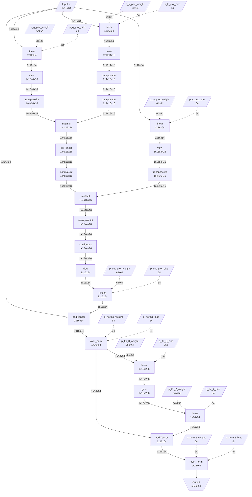

# Usage Guide

This document explains the detailed usage of the IR extraction framework.

## 1. Basic Workflow

### 1.1 Basic IR Extraction Flow

```python
import torch
import torch.nn as nn
from torch_ir import extract_ir

# 1. Define model
class MyModel(nn.Module):
    def __init__(self):
        super().__init__()
        self.conv = nn.Conv2d(3, 64, 3, padding=1)
        self.bn = nn.BatchNorm2d(64)
        self.relu = nn.ReLU()
        self.fc = nn.Linear(64 * 32 * 32, 10)

    def forward(self, x):
        x = self.relu(self.bn(self.conv(x)))
        x = x.flatten(1)
        return self.fc(x)

# 2. Create model on meta device
with torch.device('meta'):
    model = MyModel()

# 3. Set model to eval mode (important!)
model.eval()

# 4. Prepare example inputs
example_inputs = (torch.randn(1, 3, 32, 32, device='meta'),)

# 5. Extract IR
ir = extract_ir(model, example_inputs, model_name="MyModel")

# 6. Check results
print(ir)
```

### 1.2 Important Notes

- **eval() mode**: Required for BatchNorm, Dropout, etc. to work correctly
- **meta device**: Both model and inputs must be on meta device
- **static shape**: Dynamic shapes are not supported

## 2. IR Analysis

### 2.1 Exploring IR Structure

```python
# Basic IR information
print(f"Model: {ir.model_name}")
print(f"PyTorch version: {ir.pytorch_version}")
print(f"Total nodes: {len(ir.nodes)}")
print(f"Total weights: {len(ir.weights)}")

# Graph inputs and outputs
print("\nGraph Inputs:")
for inp in ir.graph_inputs:
    print(f"  {inp.name}: shape={inp.shape}, dtype={inp.dtype}")

print("\nGraph Outputs:")
for out in ir.graph_outputs:
    print(f"  {out.name}: shape={out.shape}, dtype={out.dtype}")
```

### 2.2 Node Analysis

```python
# Iterate through all nodes
for node in ir.nodes:
    print(f"\nNode: {node.name}")
    print(f"  Op type: {node.op_type}")
    print(f"  Inputs:")
    for inp in node.inputs:
        print(f"    - {inp.name}: {inp.shape}")
    print(f"  Outputs:")
    for out in node.outputs:
        print(f"    - {out.name}: {out.shape}")
    if node.attrs:
        print(f"  Attrs: {node.attrs}")
```

### 2.3 Operator Statistics

```python
from collections import Counter

# Count by operator type
op_counts = Counter(node.op_type for node in ir.nodes)

print("Operation counts:")
for op_type, count in op_counts.most_common():
    print(f"  {op_type}: {count}")
```

### 2.4 Weight Information

```python
# Weight metadata
print("Weights:")
for weight in ir.weights:
    print(f"  {weight.name}: shape={weight.shape}, dtype={weight.dtype}")

# Weight name mapping (placeholder → state_dict key)
print("\nWeight name mapping:")
for placeholder, sd_key in ir.weight_name_mapping.items():
    print(f"  {placeholder} → {sd_key}")
```

## 3. Saving and Loading IR

### 3.1 Save to JSON File

```python
# Save
ir.save("model_ir.json")

# Or use serializer
from torch_ir import save_ir, serialize_ir

save_ir(ir, "model_ir.json")

# Serialize to JSON string
json_str = serialize_ir(ir)
```

### 3.2 Load from JSON File

```python
from torch_ir import load_ir, deserialize_ir

# Load from file
loaded_ir = load_ir("model_ir.json")

# Or use IR.load()
from torch_ir import IR
loaded_ir = IR.load("model_ir.json")

# Deserialize from JSON string
ir = deserialize_ir(json_str)
```

### 3.3 IR Validation

```python
from torch_ir import validate_ir

# Validate IR structure
try:
    validate_ir(ir)
    print("IR is valid")
except Exception as e:
    print(f"IR validation failed: {e}")
```

## 4. IR Execution and Verification

### 4.1 IR Execution

You can execute the IR with actual weights to obtain results.

```python
from torch_ir import IRExecutor, execute_ir

# Get weights from original model
original_model = MyModel()
original_model.load_state_dict(torch.load('weights.pt'))
state_dict = original_model.state_dict()

# Method 1: Use IRExecutor
executor = IRExecutor(ir)
executor.load_weights_from_state_dict(state_dict)

test_input = torch.randn(1, 3, 32, 32)
outputs = executor.execute((test_input,))

# Method 2: Use execute_ir function
outputs = execute_ir(ir, (test_input,), weights=state_dict)

print(f"Output shape: {outputs[0].shape}")
```

### 4.2 Verification Against Original Model

```python
from torch_ir import verify_ir_with_state_dict, verify_ir

# Prepare original model
original_model = MyModel()
original_model.load_state_dict(torch.load('weights.pt'))
original_model.eval()

# Test inputs
test_inputs = (torch.randn(1, 3, 32, 32),)

# Verify (using state_dict)
is_valid, report = verify_ir_with_state_dict(
    ir=ir,
    state_dict=original_model.state_dict(),
    original_model=original_model,
    test_inputs=test_inputs,
    rtol=1e-5,  # Relative error tolerance
    atol=1e-5,  # Absolute error tolerance
)

print(f"Verification: {'PASSED' if is_valid else 'FAILED'}")
print(report)

# Verify (using file path)
torch.save(original_model.state_dict(), 'weights.pt')
is_valid, report = verify_ir(
    ir=ir,
    weights_path='weights.pt',
    original_model=original_model,
    test_inputs=test_inputs,
)
```

### 4.3 Analyzing Verification Results

```python
if not is_valid:
    print(f"Max difference: {report.max_diff}")
    print(f"Mean difference: {report.mean_diff}")
    print(f"Error message: {report.error_message}")

    # Analyze individual outputs
    for detail in report.output_details:
        print(f"  Output {detail['index']}: "
              f"shape={detail['shape']}, "
              f"is_close={detail['is_close']}, "
              f"max_diff={detail['max_diff']:.2e}")
```

## 5. Various Model Types

### 5.1 CNN Models

```python
import torchvision.models as models

# Create ResNet on meta device
with torch.device('meta'):
    model = models.resnet18()
model.eval()

inputs = (torch.randn(1, 3, 224, 224, device='meta'),)
ir = extract_ir(model, inputs, model_name="ResNet18")

print(f"ResNet18 IR: {len(ir.nodes)} nodes, {len(ir.weights)} weights")
```

### 5.2 Sequential Models

```python
with torch.device('meta'):
    model = nn.Sequential(
        nn.Linear(784, 256),
        nn.ReLU(),
        nn.Dropout(0.2),
        nn.Linear(256, 128),
        nn.ReLU(),
        nn.Linear(128, 10),
    )
model.eval()

inputs = (torch.randn(1, 784, device='meta'),)
ir = extract_ir(model, inputs, model_name="MLP")
```

### 5.3 Transformer Models

```python
with torch.device('meta'):
    encoder_layer = nn.TransformerEncoderLayer(d_model=512, nhead=8)
    model = nn.TransformerEncoder(encoder_layer, num_layers=6)
model.eval()

inputs = (torch.randn(10, 1, 512, device='meta'),)  # (seq_len, batch, d_model)
ir = extract_ir(model, inputs, model_name="TransformerEncoder")
```

### 5.4 Multi-Input Models

```python
class MultiInputModel(nn.Module):
    def __init__(self):
        super().__init__()
        self.fc1 = nn.Linear(10, 20)
        self.fc2 = nn.Linear(5, 20)
        self.fc3 = nn.Linear(40, 10)

    def forward(self, x1, x2):
        h1 = self.fc1(x1)
        h2 = self.fc2(x2)
        return self.fc3(torch.cat([h1, h2], dim=1))

with torch.device('meta'):
    model = MultiInputModel()
model.eval()

inputs = (
    torch.randn(1, 10, device='meta'),
    torch.randn(1, 5, device='meta'),
)
ir = extract_ir(model, inputs)
```

## 6. Weight Management

### 6.1 Loading Weights

```python
from torch_ir import load_weights, load_weights_pt, load_weights_safetensors

# Auto-detect format
weights = load_weights('model.pt')

# Specify format
weights = load_weights_pt('model.pt')
weights = load_weights_safetensors('model.safetensors')
```

### 6.2 Weight Validation

```python
from torch_ir.weight_loader import validate_weights_against_ir

# Validate that weights match IR
errors = validate_weights_against_ir(weights, ir)
if errors:
    print("Weight validation errors:")
    for error in errors:
        print(f"  - {error}")
else:
    print("Weights are valid")
```

## 7. Advanced Usage

### 7.1 Strict Mode

```python
# Strict mode: Raises exception on conversion errors
try:
    ir = extract_ir(model, inputs, strict=True)
except Exception as e:
    print(f"Conversion error: {e}")

# Non-strict (default): Falls back to default converter on conversion errors
ir = extract_ir(model, inputs, strict=False)
```

> All ATen operators are automatically supported, so most models work correctly even with `strict=False`.

### 7.2 Custom Model Name

```python
ir = extract_ir(model, inputs, model_name="MyCustomModel_v2")
print(ir.model_name)  # "MyCustomModel_v2"
```

### 7.3 Using IRConverter Directly

```python
from torch_ir import export_model
from torch_ir.converter import IRConverter, convert_exported_program

# Call torch.export directly
exported = export_model(model, inputs, strict=False)

# Use Converter
converter = IRConverter(strict=False)
ir = converter.convert(exported, model_name="MyModel")

# Or use function directly
ir = convert_exported_program(exported, model_name="MyModel")
```

### 7.4 Using GraphAnalyzer Directly

```python
from torch_ir import export_model
from torch_ir.analyzer import GraphAnalyzer

exported = export_model(model, inputs, strict=False)
analyzer = GraphAnalyzer(exported)

# Extract individual information
graph_inputs = analyzer.get_graph_inputs()
graph_outputs = analyzer.get_graph_outputs()
weights = analyzer.get_weights()
weight_mapping = analyzer.get_weight_name_mapping()
nodes = analyzer.get_call_function_nodes()
```

## 8. Common Patterns

### 8.1 Full Pipeline Example

```python
import torch
from torch_ir import extract_ir, verify_ir_with_state_dict

def full_pipeline(model_class, input_shape, weights_path):
    """Full pipeline from IR extraction to verification"""

    # 1. Original model (for verification)
    original = model_class()
    original.load_state_dict(torch.load(weights_path))
    original.eval()

    # 2. Meta model (for IR extraction)
    with torch.device('meta'):
        meta_model = model_class()
    meta_model.eval()

    # 3. Extract IR
    inputs = (torch.randn(*input_shape, device='meta'),)
    ir = extract_ir(meta_model, inputs)

    # 4. Save IR
    ir.save(f"{model_class.__name__}_ir.json")

    # 5. Verify
    test_inputs = (torch.randn(*input_shape),)
    is_valid, report = verify_ir_with_state_dict(
        ir=ir,
        state_dict=original.state_dict(),
        original_model=original,
        test_inputs=test_inputs,
    )

    return ir, is_valid, report

# Usage example
ir, valid, report = full_pipeline(MyModel, (1, 3, 32, 32), 'weights.pt')
```

### 8.2 Batch IR Extraction

```python
def extract_multiple_models(model_configs):
    """Extract IR for multiple models at once"""
    results = {}

    for name, (model_class, input_shape) in model_configs.items():
        with torch.device('meta'):
            model = model_class()
        model.eval()

        inputs = (torch.randn(*input_shape, device='meta'),)
        ir = extract_ir(model, inputs, model_name=name)
        ir.save(f"{name}_ir.json")

        results[name] = ir
        print(f"{name}: {len(ir.nodes)} nodes")

    return results

# Usage example
configs = {
    "ResNet18": (models.resnet18, (1, 3, 224, 224)),
    "ResNet50": (models.resnet50, (1, 3, 224, 224)),
    "VGG16": (models.vgg16, (1, 3, 224, 224)),
}
irs = extract_multiple_models(configs)
```

## 9. Comprehensive Test System

### 9.1 Test Models

The framework provides test models covering various computation graph patterns:

| Category | Model | Description |
|---------|------|------|
| multi_io | SiameseEncoder | Apply same encoder to two images |
| multi_io | MultiTaskHead | Shared backbone + multi-output heads |
| skip_connections | DeepResNet | Multiple residual blocks |
| skip_connections | DenseBlock | DenseNet-style connections |
| shared_weights | RecurrentUnroll | Repeated application of same cell |
| shared_weights | WeightTying | Embedding-output weight sharing |
| attention | SelfAttention | Basic self-attention |
| attention | CrossAttention | Cross-attention |
| attention | TransformerBlock | Complete transformer block |

### 9.2 Running pytest

```bash
# Basic run
pytest tests/test_comprehensive.py -v

# Generate reports
pytest tests/test_comprehensive.py --generate-reports --output reports/

# Category filter
pytest tests/test_comprehensive.py -k "attention" --generate-reports
```

### 9.3 Running CLI

```bash
# Full test
python -m tests --output reports/

# Category filter
python -m tests --category attention

# Single model
python -m tests --model SelfAttention

# List models
python -m tests --list-models

# List categories
python -m tests --list-categories
```

### 9.4 Report Structure

Test reports are generated in markdown format:

```
reports/
├── SUMMARY.md           # Overall summary
├── SelfAttention.md     # Individual model report
├── TransformerBlock.md
└── ...
```

Each model report includes the following information:

- **Summary table**: nodes, edges, inputs, outputs, weights, total params
- **Numerical Verification**: max_diff, mean_diff
- **DAG Visualization**: Mermaid flowchart
- **Operator Distribution**: Mermaid pie chart
- **Node Details**: Collapsible table
- **Weight Metadata**: Table

### 9.5 Adding Custom Test Models

```python
from tests.models.base import register_model

@register_model(
    name="MyCustomModel",
    input_shapes=[(3, 32, 32)],
    categories=["custom"],
    description="My custom test model"
)
class MyCustomModel(nn.Module):
    def __init__(self):
        super().__init__()
        self.conv = nn.Conv2d(3, 64, 3)

    def forward(self, x):
        return self.conv(x)
```

## 10. CLI Tools

The `torch-ir` CLI allows you to inspect and visualize IR files directly from the terminal without writing Python code.

### 10.1 IR Summary

```bash
# Display IR summary
torch-ir info model_ir.json

# JSON format output
torch-ir info model_ir.json --json

# Save to file
torch-ir info model_ir.json --json -o summary.json
```

For example, a DeepResNet model with 3 residual blocks:

```
Model: DeepResNet
Nodes: 27
Inputs: 1
Outputs: 1
Weights: 51
Total parameters: 57,617

Input shapes:
  x: [1, 3, 32, 32]

Output shapes:
  linear: [1, 10]

Op distribution:
  aten.conv2d.default: 7
  aten.batch_norm.default: 7
  aten.relu.default: 7
  aten.add.Tensor: 3
  aten.adaptive_avg_pool2d.default: 1
  aten.flatten.using_ints: 1
  aten.linear.default: 1
```

### 10.2 Graph Visualization

```bash
# Print Mermaid diagram to stdout
torch-ir visualize model_ir.json

# Save as Mermaid text file
torch-ir visualize model_ir.json -o graph.mmd

# Render as PNG/SVG image (requires: pip install torch-ir[rendering])
torch-ir visualize model_ir.json -o graph.png
torch-ir visualize model_ir.json -o graph.svg

# Limit displayed nodes for large graphs
torch-ir visualize model_ir.json --max-nodes 50
```

Below is the actual IR graph of a TransformerBlock (self-attention + FFN + residual connections).
The Q/K/V projections branch out in parallel, and `add.Tensor` nodes represent residual connections:



For full CLI documentation, see the [CLI Reference](cli.md).

## 11. Next Steps

- [API Reference](api/index.md) - Detailed API documentation
- [Operator Support](operators.md) - List of supported operators
- [Extension Guide](extending.md) - Adding custom operators
